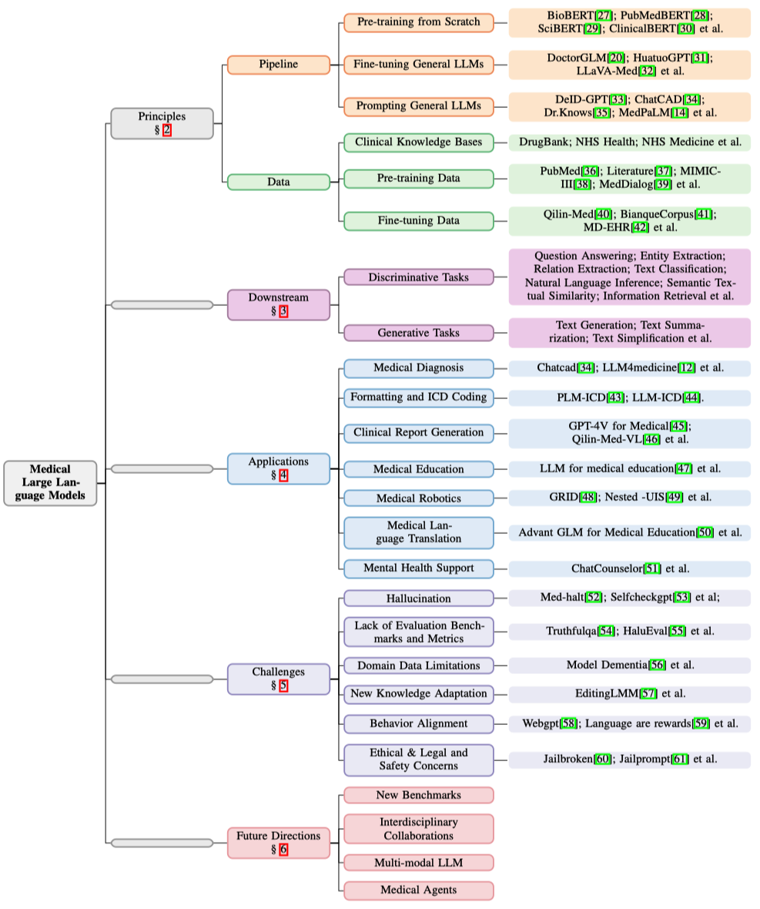
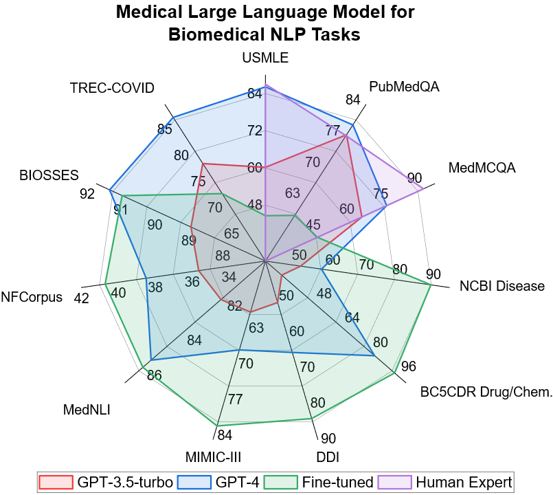

<div align=center>

</div>
<h2 align="center"> A Practical Guide for Medical Large Language Models </a></h2>
<h5 align="center"> If you like our project, please give us a star ⭐ on GitHub for the latest update.</h5>

<h5 align="center">


   
   [](https://arxiv.org/pdf/2311.05112.pdf)
   [](https://hits.seeyoufarm.com)
   


</h5>

This is an actively updated list of practical guide resources for Medical Large Language Models (Medical LLMs). 
It's based on our survey paper: [A Survey of Large Language Models in Medicine: Principles, Applications, and Challenges](https://arxiv.org/abs/2311.05112). 

## ⚡ Contributing

If you want to add your work or model to this list, please do not hesitate to email fenglin.liu@eng.ox.ac.uk and jhuang90@ur.rochester.edu or [pull requests]([https://github.com/richard-peng-xia/awesome-multimodal-in-medical-imaging/pulls](https://github.com/AI-in-Health/MedLLMsPracticalGuide/pulls)).
Markdown format:

```markdown
- [**Name of Conference or Journal + Year**] Paper Name. [[pdf]](link) [[code]](link)
```

## 🤗 Highlights

This repository aims to provide an overview of the progress, application, and challenge of LLMs in medicine, aiming to promote further research and exploration in this interdisciplinary field.


##  📣 Update Notes
[2023-12-11] We have updated our survey [version 2](https://arxiv.org/abs/2311.05112). Please check it out!

[2023-12-04] We updated the outline image and radar chart evaluation of Medical LLM. 

[2023-11-09] We released the repository.

## Table of Contents
<div align=center>

</div>

* [Practical Guide for Building Pipeline](#-practical-guide-for-building-pipeline)
   * [Pre-training from Scratch](#pre-training-from-scratch)
   * [Fine-tuning General LLMs](#fine-tuning-general-llms)
   * [Prompting General LLMs](#prompting-general-llms)
* [Practical Guide for Medical Data](#-practical-guide-for-medical-data)
   * [Clinical Knowledge Bases](#clinical-knowledge-bases)
   * [Pre-training Data](#pre-training-data)
   * [Fine-tuning Data](#fine-tuning-data)
* [Downstream Biomedical Tasks](#%EF%B8%8F-downstream-biomedical-tasks)
   * [Generative Tasks](#generative-tasks)
      * [Text Summarization](#text-summarization)
      * [Text Simplification](#text-simplification)
      * [Text Generation](#text-generation)
      * [Question Answering](#question-answering)
   * [Discriminative Tasks](#discriminative-tasks)
      * [Entity Extraction](#entity-extraction)
      * [Relation Extraction](#relation-extraction)
      * [Text Classification](#text-classification)
      * [Natural Language Inference](#natural-language-inference)
      * [Semantic Textual Similarity](#semantic-textual-similarity)
      * [Information Retrieval](#information-retrieval)
* [Practical Guide for Clinical Applications](#-practical-guide-for-clinical-applications)
   * [Medical Diagnosis](#medical-diagnosis)
   * [Formatting and ICD Coding](#formatting-and-icd-coding)
   * [Clinical Report Generation](#clinical-report-generation)
   * [Medical Education](#medical-education)
   * [Medical Robotics](#medical-robotics)
   * [Medical Language Translation](#medical-language-translation)
   * [Mental Health Support](#mental-health-support)
* [Practical Guide for Challenges](#-practical-guide-for-challenges)
   * [Hallucination](#hallucination)
   * [Lack of Evaluation Benchmarks and Metrics](#lack-of-evaluation-benchmarks-and-metrics)
   * [Domain Data Limitations](#domain-data-limitations)
   * [New Knowledge Adaptation](#new-knowledge-adaptation)
   * [Behavior Alignment](#behavior-alignment)
   * [Ethical, Legal, and Safety Concerns](#ethical-legal-and-safety-concerns)
* [Practical Guide for Future Directions](#-practical-guide-for-future-directions)
   * [Introduction of New Benchmarks](#introduction-of-new-benchmarks)
   * [Interdisciplinary Collaborations](#interdisciplinary-collaborations)
   * [Multi-modal LLM](#multi-modal-llm)
   * [Medical Agents](#medical-agents)
* [Acknowledgement](#-acknowledgement)
* [Citation](#-citation)

## 🔥 Practical Guide for Building Pipeline

### Pre-training from Scratch

* **BioBERT**: A pre-trained biomedical language representation model for biomedical text mining. 2020. [paper](https://academic.oup.com/bioinformatics/article-abstract/36/4/1234/5566506)
* **PubMedBERT**：Domain-specific language model pretraining for biomedical natural language processing. 2021. [paper](https://dl.acm.org/doi/abs/10.1145/3458754)
* **SciBERT**：A pretrained language model for scientific text. 2019. [paper](https://arxiv.org/abs/1903.10676)
* **ClinicalBERT**：Publicly available clinical BERT embeddings. 2019. [paper](https://arxiv.org/abs/1904.03323)
* **BlueBERT**：Transfer learning in biomedical natural language processing: an evaluation of BERT and ELMo on ten benchmarking datasets. 2019. [paper](https://arxiv.org/abs/1906.05474)
* **BioCPT**：Contrastive pre-trained transformers with large-scale pubmed search logs for zero-shot biomedical information retrieval. 2023. [paper](https://arxiv.org/abs/2307.00589)
* **BioGPT**：generative pre-trained transformer for biomedical text generation and mining. 2022. [paper](https://academic.oup.com/bib/article-abstract/23/6/bbac409/6713511)
* **OphGLM**：Training an Ophthalmology Large Language-and-Vision Assistant based on Instructions and Dialogue. 2023. [paper](https://arxiv.org/abs/2306.12174)
* **GatorTron**：A large language model for electronic health records. 2022. [paper](https://www.nature.com/articles/s41746-022-00742-2)
* **GatorTronGPT**：A Study of Generative Large Language Model for Medical Research and Healthcare. 2023. [paper](https://arxiv.org/abs/2305.13523)
* **MEDITRON-70B**: Scaling Medical Pretraining for Large Language Models. 2023. [paper](https://arxiv.org/abs/2311.16079)

### Fine-tuning General LLMs
* **ChatGLM-Med**：ChatGLM-Med: 基于中文医学知识的ChatGLM模型微调. 2023. [github](https://github.com/SCIR-HI/Med-ChatGLM)
* **DoctorGLM**：Fine-tuning your chinese doctor is not a herculean task. 2023. [paper](https://arxiv.org/abs/2304.01097)
* **BianQue**：Balancing the Questioning and Suggestion Ability of Health LLMs with Multi-turn Health Conversations Polished by ChatGPT. 2023. [paper](https://arxiv.org/abs/2310.15896)
* **ClinicalGPT**：Large Language Models Finetuned with Diverse Medical Data and Comprehensive Evaluation. 2023. [paper](https://arxiv.org/abs/2306.09968)
* **Qilin-Med**：Multi-stage Knowledge Injection Advanced Medical Large Language Model. 2023. [paper](https://arxiv.org/abs/2310.09089)
* **Qilin-Med-VL**：Towards Chinese Large Vision-Language Model for General Healthcare. 2023. [paper](https://arxiv.org/abs/2310.17956)
* **Zhongjing**：Enhancing the Chinese medical capabilities of large language model through expert feedback and real-world multi-turn dialogue. 2023. [paper](https://arxiv.org/abs/2308.03549)
* **ChatDoctor**：A Medical Chat Model Fine-Tuned on a Large Language Model Meta-AI (LLaMA) Using Medical Domain Knowledge. 2023. [paper](https://www.cureus.com/articles/152858-chatdoctor-a-medical-chat-model-fine-tuned-on-a-large-language-model-meta-ai-llama-using-medical-domain-knowledge.pdf)
* **BenTsao**：Tuning llama model with chinese medical knowledge. 2023. [paper](https://arxiv.org/abs/2304.06975)
* **HuatuoGPT**: HuatuoGPT, towards Taming Language Model to Be a Doctor. 2023. [paper](https://arxiv.org/abs/2305.15075)
* **LLaVA-Med**: Training a large language-and-vision assistant for biomedicine in one day. 2023. [paper](https://arxiv.org/abs/2306.00890)
* **Baize-healthcare**: An open-source chat model with parameter-efficient tuning on self-chat data. 2023. [paper](https://arxiv.org/abs/2304.01196)
* **Visual Med-Alpeca**: A parameter-efficient biomedical llm with visual capabilities. 2023. [Repo](https://github.com/cambridgeltl/visual-med-alpaca)
* **PMC-LLaMA**: Further finetuning llama on medical papers. 2023. [paper](https://arxiv.org/abs/2304.14454)
* **Clinical Camel**: An Open-Source Expert-Level Medical Language Model with Dialogue-Based Knowledge Encoding. 2023. [paper](https://arxiv.org/abs/2305.12031)
* **MedPaLM 2**: Towards expert-level medical question answering with large language models. 2023. [paper](https://arxiv.org/abs/2305.09617)
* **MedPaLM M**: Towards generalist biomedical ai. 2023. [paper](https://arxiv.org/abs/2307.14334)
* **CPLLM**: Clinical Prediction with Large Language Models. 2023. [paper](https://arxiv.org/abs/2309.11295)
* **AlpaCare**: Instruction-tuned Large Language Models for Medical Application. 2023. [paper](https://arxiv.org/abs/2310.14558)
* **From Beginner to Expert**: Modeling Medical Knowledge into General LLMs. 2023. [paper](https://arxiv.org/abs/2312.01040)
* **Taiyi**: A Bilingual Fine-Tuned Large Language Model for Diverse Biomedical Tasks. 2023. [paper](https://arxiv.org/abs/2311.11608)

### Prompting General LLMs
* **DelD-GPT**: Zero-shot medical text de-identification by gpt-4. 2023. [paper](https://arxiv.org/abs/2303.11032)
* **ChatCAD**: Interactive computer-aided diagnosis on medical image using large language models. 2023. [paper](https://arxiv.org/abs/2302.07257)
* **Dr. Knows**: Leveraging a medical knowledge graph into large language models for diagnosis prediction. 2023. [paper](https://arxiv.org/abs/2308.14321)
* **MedPaLM**: Large language models encode clinical knowledge. 2022. [paper](https://arxiv.org/abs/2212.13138)
* **MedPrompt**: Can Generalist Foundation Models Outcompete Special-Purpose Tuning? Case Study in Medicine. [paper](https://arxiv.org/abs/2311.16452)
* Enhancing Medical Task Performance in GPT-4V: A Comprehensive Study on Prompt Engineering Strategies.  [paper](https://arxiv.org/abs/2312.04344)

## 📊 Practical Guide for Medical Data

### Clinical Knowledge Bases
* **[Drugs.com](https://www.drugs.com/)**
* **[DrugBank](https://go.drugbank.com/)**
* **[NHS Health](https://www.nhs.uk/conditions/)**
* **[NHS Medicine](https://www.nhs.uk/medicines/)**
* **[Unified Medical Language System (UMLS)](https://www.nlm.nih.gov/research/umls/index.html)**
* **[The Human Phenotype Ontology](https://hpo.jax.org/app/)**
* **[Center for Disease Control and Prevention](https://www.cdc.gov/)**
* **[National Institute for Health and Care Excellence](https://www.nice.org.uk/guidance)**
* **[World Health Organization](https://www.who.int/publications/who-guidelines)**

### Pre-training Data
* **PubMed**: National Institutes of Health. PubMed Data. In National Library of Medicine. 2022. [database](https://pubmed.ncbi.nlm.nih.gov/download/)
* **Literature**: Construction of the literature graph in semantic scholar. 2018. [paper](https://arxiv.org/abs/1805.02262)
* **MIMIC-III**: MIMIC-III, a freely accessible critical care database. 2016. [paper](https://www.nature.com/articles/sdata201635)
* **PubMed**: The pile: An 800gb dataset of diverse text for language modeling. 2020. [paper](https://arxiv.org/abs/2101.00027)
* **MedDialog**: Meddialog: Two large-scale medical dialogue datasets. 2020. [paper](https://arxiv.org/abs/2004.03329)
* **EHRs**: A large language model for electronic health records. 2022. [paper](https://www.nature.com/articles/s41746-022-00742-2)
* **EHRs**: A Study of Generative Large Language Model for Medical Research and Healthcare. 2023. [paper](https://arxiv.org/abs/2305.13523)
* **Guidelines** A high-quality collection of clinical practice guidelines (CPGs) for the medical training of LLMs. [dataset](https://huggingface.co/datasets/epfl-llm/guidelines)
* **GAP-REPLAY** Scaling Medical Pretraining for Large Language Models. 2023. [paper](https://arxiv.org/abs/2311.16079)
### Fine-tuning Data
* **cMeKG**：Chinese Medical Knowledge Graph. 2023. [github](https://github.com/king-yyf/CMeKG_tools)
* **CMD.**: Chinese medical dialogue data. 2023. [repo](https://github.com/Toyhom/Chinese-medical-dialogue-data)
* **BianQueCorpus**: BianQue: Balancing the Questioning and Suggestion Ability of Health LLMs with Multi-turn Health Conversations Polished by ChatGPT. 2023. [paper](https://arxiv.org/abs/2310.15896)
* **MD-EHR**: ClinicalGPT: Large Language Models Finetuned with Diverse Medical Data and Comprehensive Evaluation. 2023. [paper](https://arxiv.org/abs/2306.09968)
* **VariousMedQA**: Multi-scale attentive interaction networks for chinese medical question answer selection. 2018. [paper](https://ieeexplore.ieee.org/abstract/document/8548603/)
* **VariousMedQA**: What disease does this patient have? a large-scale open domain question answering dataset from medical exams. 2021. [paper](https://www.mdpi.com/2076-3417/11/14/6421)
* **MedDialog**: Meddialog: Two large-scale medical dialogue datasets. 2020. [paper](https://arxiv.org/abs/2004.03329)
* **ChiMed**: Qilin-Med: Multi-stage Knowledge Injection Advanced Medical Large Language Model. 2023. [paper](https://arxiv.org/abs/2310.09089)
* **ChiMed-VL**: Qilin-Med-VL: Towards Chinese Large Vision-Language Model for General Healthcare. 2023. [paper](https://arxiv.org/abs/2310.17956)
* **Healthcare Magic**: Healthcare Magic. [platform](https://www.healthcaremagic.com/)
* **ICliniq**: ICliniq. [platform](https://www.icliniq.com/)
* **Hybrid SFT**: HuatuoGPT, towards Taming Language Model to Be a Doctor. 2023. [paper](https://arxiv.org/abs/2305.15075)
* **PMC-15M**: Large-scale domain-specific pretraining for biomedical vision-language processing. 2023. [paper](https://arxiv.org/abs/2303.00915)
* **MedQuAD**: A question-entailment approach to question answering. 2019. [paper](https://bmcbioinformatics.biomedcentral.com/articles/10.1186/s12859-019-3119-4?ref=https://githubhelp.com)
* **VariousMedQA**: Visual med-alpaca: A parameter-efficient biomedical llm with visual capabilities. 2023. [repo](https://github.com/cambridgeltl/visual-med-alpaca)
* **CMtMedQA**:Zhongjing: Enhancing the Chinese medical capabilities of large language model through expert feedback and real-world multi-turn dialogue. 2023. [paper](https://arxiv.org/abs/2308.03549)
* **MTB**: Med-flamingo: a multimodal medical few-shot learner. 2023. [paper](https://arxiv.org/abs/2307.15189)
* **PMC-OA**: Pmc-clip: Contrastive language-image pre-training using biomedical documents. 2023. [paper](https://arxiv.org/abs/2303.07240)
* **Medical Meadow**: MedAlpaca--An Open-Source Collection of Medical Conversational AI Models and Training Data. 2023. [paper](https://arxiv.org/abs/2304.08247)
* **Literature**: S2ORC: The semantic scholar open research corpus. 2019. [paper](https://arxiv.org/abs/1911.02782)
* **MedC-I**: Pmc-llama: Further finetuning llama on medical papers. 2023. [paper](https://arxiv.org/abs/2304.14454)
* **ShareGPT**: Sharegpt. 2023. [platform](https://sharegpt.com/)
* **PubMed**: National Institutes of Health. PubMed Data. In National Library of Medicine. 2022. [database](https://pubmed.ncbi.nlm.nih.gov/download/)
* **MedQA**: What disease does this patient have? a large-scale open domain question answering dataset from medical exams. 2021. [paper](https://www.mdpi.com/2076-3417/11/14/6421)
* **MultiMedQA**: Towards expert-level medical question answering with large language models. 2023. [paper](https://arxiv.org/abs/2305.09617)
* **MultiMedBench**: Towards generalist biomedical ai. 2023. [paper](https://arxiv.org/abs/2307.14334)
* **MedInstruct-52**: Instruction-tuned Large Language Models for Medical Application. 2023. [paper](https://arxiv.org/abs/2310.14558)
* **eICU-CRD**: The eicu collaborative research database, a freely available multi-center database for critical care research. 2018. [paper](https://www.nature.com/articles/sdata2018178)
* **MIMIC-IV**: MIMIC-IV, a freely accessible electronic health record dataset. 2023. [paper](https://www.nature.com/articles/s41597-022-01899-x) [database](https://physionet.org/content/mimiciv/2.2/)
* **PMC-Patients**: 167k open patient summaries. 2023. [paper](https://arxiv.org/abs/2202.13876) [database](https://huggingface.co/datasets/zhengyun21/PMC-Patients)
  
## 🗂️ Downstream Biomedical Tasks

<div align=center>

</div>

### Generative Tasks

#### Text Summarization
* **PubMed**: National Institutes of Health. PubMed Data. In National Library of Medicine. [database](https://pubmed.ncbi.nlm.nih.gov/download/)
* **PMC**: National Institutes of Health. PubMed Central Data. In National Library of Medicine. [database](https://www.ncbi.nlm.nih.gov/pmc/)
* **CORD-19**: Cord-19: The covid-19 open research dataset 2020. [paper](https://www.ncbi.nlm.nih.gov/pmc/articles/PMC7251955/)
* **MentSum**: Mentsum: A resource for exploring summarization of mental health online posts 2022. [paper](https://arxiv.org/abs/2206.00856)
* **MeQSum**: On the summarization of consumer health questions 2019. [paper](https://aclanthology.org/P19-1215/)

#### Text Simplification
* **MultiCochrane**: Multilingual Simplification of Medical Texts 2023. [paper](https://arxiv.org/abs/2305.12532)
* **AutoMeTS**: AutoMeTS: the autocomplete for medical text simplification 2020. [paper](https://arxiv.org/abs/2010.10573)

#### Question Answering
* **BioASQ-QA**: BioASQ-QA: A manually curated corpus for Biomedical Question Answering 2023. [paper](https://www.nature.com/articles/s41597-023-02068-4)
* **emrQA**: emrqa: A large corpus for question answering on electronic medical records 2018. [paper](https://arxiv.org/abs/1809.00732)
* **CliCR**: CliCR: a dataset of clinical case reports for machine reading comprehension 2018. [paper](https://arxiv.org/abs/1803.09720)
* **PubMedQA**: Pubmedqa: A dataset for biomedical research question answering 2019. [paper](https://arxiv.org/abs/1909.06146)
* **COVID-QA**: COVID-QA: A question answering dataset for COVID-19 2020. [paper](https://aclanthology.org/2020.nlpcovid19-acl.18/)
* **MASH-QA**: Question answering with long multiple-span answers 2020. [paper](https://aclanthology.org/2020.findings-emnlp.342/)
* **Health-QA**: A hierarchical attention retrieval model for healthcare question answering 2019. [paper](https://dl.acm.org/doi/abs/10.1145/3308558.3313699)
* **MedQA**: What disease does this patient have? a large-scale open domain question answering dataset from medical exams 2021. [paper](https://www.mdpi.com/2076-3417/11/14/6421)
* **MedMCQA**: Medmcqa: A large-scale multi-subject multi-choice dataset for medical domain question answering 2022. [paper](https://proceedings.mlr.press/v174/pal22a.html)
* **MMLU (Clinical Knowledge)**: Measuring massive multitask language understanding 2020. [paper](https://arxiv.org/abs/2009.03300)
* **MMLU (College Medicine)**: Measuring massive multitask language understanding 2020. [paper](https://arxiv.org/abs/2009.03300)
* **MMLU (Professional Medicine)**: Measuring massive multitask language understanding 2020. [paper](https://arxiv.org/abs/2009.03300)

### Discriminative Tasks

#### Entity Extraction
* **NCBI Disease**: NCBI disease corpus: a resource for disease name recognition and concept normalization 2014. [paper](https://www.sciencedirect.com/science/article/pii/S1532046413001974)
* **JNLPBA**: Introduction to the bio-entity recognition task at JNLPBA 2004. [paper](https://aclanthology.org/W04-1213.pdf)
* **GENIA**: GENIA corpus--a semantically annotated corpus for bio-textmining 2003. [paper](https://www.researchgate.net/profile/Jin-Dong-Kim-2/publication/10667350_GENIA_corpus-A_semantically_annotated_corpus_for_bio-textmining/links/00b49520d9a33ae419000000/GENIA-corpus-A-semantically-annotated-corpus-for-bio-textmining.pdf)
* **BC5CDR**: BioCreative V CDR task corpus: a resource for chemical disease relation extraction 2016. [paper](https://academic.oup.com/database/article/doi/10.1093/database/baw068/2630414?ref=https%3A%2F%2Fgithubhelp.com&login=true)
* **BC4CHEMD**: The CHEMDNER corpus of chemicals and drugs and its annotation principles 2015. [paper](https://jcheminf.biomedcentral.com/articles/10.1186/1758-2946-7-S1-S2)
* **BioRED**: BioRED: a rich biomedical relation extraction dataset 2022. [paper](https://academic.oup.com/bib/article-abstract/23/5/bbac282/6645993)
* **CMeEE**: Cblue: A chinese biomedical language understanding evaluation benchmark 2021. [paper](https://arxiv.org/abs/2106.08087)
* **NLM-Chem-BC7**: NLM-Chem-BC7: manually annotated full-text resources for chemical entity annotation and indexing in biomedical articles 2022. [paper](https://academic.oup.com/database/article-abstract/doi/10.1093/database/baac102/6858529)
* **ADE**: Development of a benchmark corpus to support the automatic extraction of drug-related adverse effects from medical case reports 2012. [paper](https://www.sciencedirect.com/science/article/pii/S1532046412000615)
* **2012 i2b2**: Evaluating temporal relations in clinical text: 2012 i2b2 challenge 2013. [paper](https://academic.oup.com/jamia/article-abstract/20/5/806/726374)
* **2014 i2b2/UTHealth (Track 1)**: Annotating longitudinal clinical narratives for de-identification: The 2014 i2b2/UTHealth corpus 2015. [paper](https://www.sciencedirect.com/science/article/pii/S1532046415001823)
* **2018 n2c2 (Track 2)**: 2018 n2c2 shared task on adverse drug events and medication extraction in electronic health records 2020. [paper](https://academic.oup.com/jamia/article-abstract/27/1/3/5581277)
* **Cadec**: Cadec: A corpus of adverse drug event annotations 2015. [paper](https://www.sciencedirect.com/science/article/pii/S1532046415000532)
* **DDI**: Semeval-2013 task 9: Extraction of drug-drug interactions from biomedical texts (ddiextraction 2013) 2013. [paper](https://e-archivo.uc3m.es/handle/10016/20455)
* **PGR**: A silver standard corpus of human phenotype-gene relations 2019. [paper](https://arxiv.org/abs/1903.10728)
* **EU-ADR**: The EU-ADR corpus: annotated drugs, diseases, targets, and their relationships 2012. [paper](https://www.sciencedirect.com/science/article/pii/S1532046412000573)

#### Relation Extraction
* **BC5CDR**: BioCreative V CDR task corpus: a resource for chemical disease relation extraction 2016. [paper](https://academic.oup.com/database/article/doi/10.1093/database/baw068/2630414?ref=https%3A%2F%2Fgithubhelp.com&login=true)
* **BioRED**: BioRED: a rich biomedical relation extraction dataset 2022. [paper](https://academic.oup.com/bib/article-abstract/23/5/bbac282/6645993)
* **ADE**: Development of a benchmark corpus to support the automatic extraction of drug-related adverse effects from medical case reports 2012. [paper](https://www.sciencedirect.com/science/article/pii/S1532046412000615)
* **2018 n2c2 (Track 2)**: 2018 n2c2 shared task on adverse drug events and medication extraction in electronic health records 2020. [paper](https://academic.oup.com/jamia/article-abstract/27/1/3/5581277)
* **2010 i2b2/VA**: 2010 i2b2/VA challenge on concepts, assertions, and relations in clinical text 2011. [paper](https://academic.oup.com/jamia/article-abstract/18/5/552/830538)
* **ChemProt**: Overview of the BioCreative VI chemical-protein interaction Track 2017. [database](https://biocreative.bioinformatics.udel.edu/news/corpora/chemprot-corpus-biocreative-vi/)
* **GDA**: Renet: A deep learning approach for extracting gene-disease associations from literature 2019. [paper](https://link.springer.com/chapter/10.1007/978-3-030-17083-7_17)
* **DDI**: Semeval-2013 task 9: Extraction of drug-drug interactions from biomedical texts (ddiextraction 2013) 2013. [paper](https://e-archivo.uc3m.es/handle/10016/20455)
* **GAD**: The genetic association database 2004. [paper](https://www.nature.com/articles/ng0504-431)
* **2012 i2b2**: Evaluating temporal relations in clinical text: 2012 i2b2 challenge 2013. [paper](https://academic.oup.com/jamia/article-abstract/20/5/806/726374)
* **PGR**: A silver standard corpus of human phenotype-gene relations 2019. [paper](https://arxiv.org/abs/1903.10728)
* **EU-ADR**: The EU-ADR corpus: annotated drugs, diseases, targets, and their relationships 2012. [paper](https://www.sciencedirect.com/science/article/pii/S1532046412000573)

#### Text Classification
* **ADE**: Development of a benchmark corpus to support the automatic extraction of drug-related adverse effects from medical case reports 2012. [paper](https://www.sciencedirect.com/science/article/pii/S1532046412000615)
* **2014 i2b2/UTHealth (Track 2)**: Annotating longitudinal clinical narratives for de-identification: The 2014 i2b2/UTHealth corpus 2015. [paper](https://www.sciencedirect.com/science/article/pii/S1532046415001823)
* **HoC**: Automatic semantic classification of scientific literature according to the hallmarks of cancer 2016. [paper](https://academic.oup.com/bioinformatics/article-abstract/32/3/432/1743783)
* **OHSUMED**: OHSUMED: An interactive retrieval evaluation and new large test collection for research 1994. [paper](https://link.springer.com/chapter/10.1007/978-1-4471-2099-5_20)
* **WNUT-2020 Task 2**: WNUT-2020 task 2: identification of informative COVID-19 english tweets 2020. [paper](https://arxiv.org/abs/2010.08232)
* **Medical Abstracts**: Evaluating unsupervised text classification: zero-shot and similarity-based approaches 2022. [paper](https://arxiv.org/abs/2211.16285)
* **MIMIC-III**: MIMIC-III, a freely accessible critical care database 2016. [paper](https://www.nature.com/articles/sdata201635)

#### Natural Language Inference
* **MedNLI**: Lessons from natural language inference in the clinical domain 2018. [paper](https://arxiv.org/abs/1808.06752)
* **BioNLI**: BioNLI: Generating a Biomedical NLI Dataset Using Lexico-semantic Constraints for Adversarial Examples 2022. [paper](https://arxiv.org/abs/2210.14814)

#### Semantic Textual Similarity
* **MedSTS**: MedSTS: a resource for clinical semantic textual similarity 2020. [paper](https://link.springer.com/article/10.1007/s10579-018-9431-1)
* **2019 n2c2/OHNLP**: The 2019 n2c2/ohnlp track on clinical semantic textual similarity: overview 2020. [paper](https://medinform.jmir.org/2020/11/e23375)
* **BIOSSES**: BIOSSES: a semantic sentence similarity estimation system for the biomedical domain 2017. [paper](https://academic.oup.com/bioinformatics/article-abstract/33/14/i49/3953954)

#### Information Retrieval
* **TREC-COVID**: TREC-COVID: constructing a pandemic information retrieval test collection 2021. [paper](https://dl.acm.org/doi/abs/10.1145/3451964.3451965)
* **NFCorpus**: A full-text learning to rank dataset for medical information retrieval 2016. [paper](https://link.springer.com/chapter/10.1007/978-3-319-30671-1_58)
* **BioASQ (BEIR)**: Beir: A heterogenous benchmark for zero-shot evaluation of information retrieval models 2021. [paper](https://arxiv.org/abs/2104.08663)

## ✨ Practical Guide for Clinical Applications

### Retrieval-augmented Generation
* Retrieve, Summarize, and Verify: How Will ChatGPT Affect Information Seeking from the Medical Literature? [paper](https://journals.lww.com/jasn/fulltext/2023/08000/retrieve,_summarize,_and_verify__how_will_chatgpt.4.aspx)

### Medical Diagnosis
* Designing a Deep Learning-Driven Resource-Efficient Diagnostic System for Metastatic Breast Cancer: Reducing Long Delays of Clinical Diagnosis and Improving Patient Survival in Developing Countries. 2023. [paper](https://arxiv.org/abs/2308.02597)
* AI in health and medicine. 2022. [paper](https://www.nature.com/articles/s41591-021-01614-0)
* Large language models in medicine. 2023. [paper](https://www.nature.com/articles/s41591-023-02448-8)
* Leveraging a medical knowledge graph into large language models for diagnosis prediction. 2023. [paper](https://arxiv.org/abs/2308.14321)
* Chatcad: Interactive computer-aided diagnosis on medical image using large language models. 2023. [paper](https://arxiv.org/abs/2302.07257)

### Formatting and ICD-Coding
* Applying large language model artificial intelligence for retina International Classification of Diseases (ICD) coding. 2023. [paper](https://jmai.amegroups.org/article/view/8198/html)
* PLM-ICD: automatic ICD coding with pretrained language models. 2022. [paper](https://arxiv.org/abs/2207.05289)

### Clinical Report Generation
* Using ChatGPT to write patient clinic letters. 2023. [paper](https://www.thelancet.com/journals/landig/article/PIIS2589-7500(23)00048-1/fulltext)
* ChatGPT: the future of discharge summaries?. 2023. [paper](https://www.thelancet.com/journals/landig/article/PIIS2589-7500(23)00021-3/fulltext)
* Chatcad: Interactive computer-aided diagnosis on medical image using large language models. 2023. [paper](https://arxiv.org/abs/2302.07257)
* Can GPT-4V (ision) Serve Medical Applications? Case Studies on GPT-4V for Multimodal Medical Diagnosis. 2023. [paper](https://arxiv.org/abs/2310.09909)
* Qilin-Med-VL: Towards Chinese Large Vision-Language Model for General Healthcare. 2023. [paper](https://arxiv.org/abs/2310.17956)
* Customizing General-Purpose Foundation Models for Medical Report Generation. 2023. [paper](https://arxiv.org/abs/2306.05642)
* Towards generalist foundation model for radiology. 2023. [paper](https://arxiv.org/abs/2308.02463)
* Clinical Text Summarization: Adapting Large Language Models Can Outperform Human Experts. 2023. [paper](https://arxiv.org/abs/2309.07430)
* MAIRA-1: A specialised large multimodal model for radiology report generation. 2023. [paper](https://arxiv.org/abs/2311.13668)
* Consensus, dissensus and synergy between clinicians and specialist foundation models in radiology report generation.  2023. [paper](https://arxiv.org/pdf/2311.18260.pdf)

### Medical Education
* Large Language Models in Medical Education: Opportunities, Challenges, and Future Directions. 2023. [paper](https://mededu.jmir.org/2023/1/e48291/)
* The Advent of Generative Language Models in Medical Education. 2023. [paper](https://mededu.jmir.org/2023/1/e48163)
* The impending impacts of large language models on medical education. 2023. [paper](https://www.ncbi.nlm.nih.gov/pmc/articles/PMC10020064/)

### Medical Robotics
* A Nested U-Structure for Instrument Segmentation in Robotic Surgery. 2023. [paper](https://ieeexplore.ieee.org/abstract/document/10218893/)
* The multi-trip autonomous mobile robot scheduling problem with time windows in a stochastic environment at smart hospitals. 2023. [paper](https://www.mdpi.com/2076-3417/13/17/9879)
* Advanced robotics for medical rehabilitation. 2016. [paper](https://link.springer.com/content/pdf/10.1007/978-3-319-19896-5.pdf)
* GRID: Scene-Graph-based Instruction-driven Robotic Task Planning. 2023. [paper](https://arxiv.org/abs/2309.07726)
* Trust in Construction AI-Powered Collaborative Robots: A Qualitative Empirical Analysis. 2023. [paper](https://arxiv.org/abs/2308.14846)

### Medical Language Translation
* Machine translation of standardised medical terminology using natural language processing: A Scoping Review. 2023. [paper](https://www.sciencedirect.com/science/article/pii/S1871678423000432)
* The Advent of Generative Language Models in Medical Education. 2023. [paper](https://mededu.jmir.org/2023/1/e48163)
* The impending impacts of large language models on medical education. 2023. [paper](https://www.ncbi.nlm.nih.gov/pmc/articles/PMC10020064/)

### Mental Health Support
* ChatCounselor: A Large Language Models for Mental Health Support. 2023. [paper](https://arxiv.org/abs/2309.15461)
* Tell me, what are you most afraid of? Exploring the Effects of Agent Representation on Information Disclosure in Human-Chatbot Interaction, 2023, [paper](https://link.springer.com/chapter/10.1007/978-3-031-35894-4_13)
* A Brief Wellbeing Training Session Delivered by a Humanoid Social Robot: A Pilot Randomized Controlled Trial. 2023. [paper](https://link.springer.com/article/10.1007/s12369-023-01054-5)
* Real conversations with artificial intelligence: A comparison between human–human online conversations and human–chatbot conversations. 2015. [paper](https://www.sciencedirect.com/science/article/pii/S0747563215001247)
* Benefits and Harms of Large Language Models in Digital Mental Health. 2023. [paper](https://arxiv.org/abs/2311.14693)
* PsyChat: A Client-Centric Dialogue System for Mental Health Support. 2023. [paper](https://arxiv.org/abs/2312.04262) 

## ⚔️ Practical Guide for Challenges

### Hallucination
* Survey of hallucination in natural language generation. 2023. [paper](https://dl.acm.org/doi/abs/10.1145/3571730)
* Med-halt: Medical domain hallucination test for large language models. 2023. [paper](https://arxiv.org/abs/2307.15343)
* A survey of hallucination in large foundation models. 2023. [paper](https://arxiv.org/abs/2309.05922)
* Selfcheckgpt: Zero-resource black-box hallucination detection for generative large language models. 2023. [paper](https://arxiv.org/abs/2303.08896)
* Retrieval augmentation reduces hallucination in conversation. 2021. [paper](https://arxiv.org/abs/2104.07567)
* Chain-of-verification reduces hallucination in large language models. 2023. [paper](https://arxiv.org/abs/2309.11495)

### Lack of Evaluation Benchmarks and Metrics
* What disease does this patient have? a large-scale open domain question answering dataset from medical exams. 2021. [paper](https://www.mdpi.com/2076-3417/11/14/6421)
* Truthfulqa: Measuring how models mimic human falsehoods. 2021. [paper](https://arxiv.org/abs/2109.07958)
* HaluEval: A Large-Scale Hallucination Evaluation Benchmark for Large Language Models. 2023. [paper](https://ui.adsabs.harvard.edu/abs/2023arXiv230511747L/abstract)

### Domain Data Limitations
* Textbooks Are All You Need. 2023. [paper](https://arxiv.org/abs/2306.11644)
* Model Dementia: Generated Data Makes Models Forget. 2023. [paper](https://arxiv.org/abs/2305.17493)

### New Knowledge Adaptation
* Detecting Edit Failures In Large Language Models: An Improved Specificity Benchmark. 2023. [paper](https://arxiv.org/abs/2305.17553)
* Editing Large Language Models: Problems, Methods, and Opportunities. 2023. [paper](https://arxiv.org/abs/2305.13172)
* Retrieval-augmented generation for knowledge-intensive nlp tasks. 2020. [paper](https://proceedings.neurips.cc/paper/2020/hash/6b493230205f780e1bc26945df7481e5-Abstract.html)

### Behavior Alignment
* Aligning ai with shared human values. 2020. [paper](https://arxiv.org/abs/2008.02275)
* Training a helpful and harmless assistant with reinforcement learning from human feedback. 2022. [paper](https://arxiv.org/abs/2204.05862)
* Improving alignment of dialogue agents via targeted human judgements. 2022. [paper](https://arxiv.org/abs/2209.14375)
* Webgpt: Browser-assisted question-answering with human feedback. 2021. [paper](https://arxiv.org/abs/2112.09332)
* Languages are rewards: Hindsight finetuning using human feedback. 2023. [paper](https://arxiv.org/abs/2302.02676)

### Ethical, Legal, and Safety Concerns
* ChatGPT utility in healthcare education, research, and practice: systematic review on the promising perspectives and valid concerns. 2023. [paper](https://www.mdpi.com/2227-9032/11/6/887)
* ChatGPT listed as author on research papers: many scientists disapprove. 2023. [paper](https://ui.adsabs.harvard.edu/abs/2023Natur.613..620S/abstract)
* A Survey of Large Language Models for Healthcare: from Data, Technology, and Applications to Accountability and Ethics. 2023. [paper](https://arxiv.org/abs/2310.05694)
* Multi-step jailbreaking privacy attacks on chatgpt. 2023. [paper](https://arxiv.org/abs/2304.05197)
* Jailbroken: How does llm safety training fail?. 2023. [paper](https://arxiv.org/abs/2307.02483)
* "Do Anything Now": Characterizing and Evaluating In-The-Wild Jailbreak Prompts on Large Language Models. 2023. [paper](https://arxiv.org/abs/2308.03825)

## 🚀 Practical Guide for Future Directions


### Introduction of New Benchmarks
* A comprehensive benchmark study on biomedical text generation and mining with ChatGPT. 2023. [paper](https://www.biorxiv.org/content/10.1101/2023.04.19.537463.abstract)
* Creation and adoption of large language models in medicine. 2023. [paper](https://jamanetwork.com/journals/jama/article-abstract/2808296)
* Large Language Models in Sport Science & Medicine: Opportunities, Risks and Considerations. 2023. [paper](https://arxiv.org/abs/2305.03851)
* VisionFM: a Multi-Modal Multi-Task Vision Foundation
Model for Generalist Ophthalmic Artificial Intelligence. 2023. [paper](https://arxiv.org/abs/2310.04992)


### Interdisciplinary Collaborations
* Creation and adoption of large language models in medicine. 2023. [paper](https://jamanetwork.com/journals/jama/article-abstract/2808296)
* ChatGPT and Physicians' Malpractice Risk. 2023. [paper](https://jamanetwork.com/journals/jama-health-forum/fullarticle/2805334)

### Multi-modal LLM
* A Survey on Multimodal Large Language Models. 2023. [paper](https://arxiv.org/abs/2306.13549)
* Mm-react: Prompting chatgpt for multimodal reasoning and action. 2023. [paper](https://arxiv.org/abs/2303.11381)
* ChatGPT for shaping the future of dentistry: the potential of multi-modal large language model. 2023. [paper](https://www.nature.com/articles/s41368-023-00239-y)
* Frozen Language Model Helps ECG Zero-Shot Learning. 2023. [paper](https://arxiv.org/abs/2303.12311)
* Exploring and Characterizing Large Language Models For Embedded System Development and Debugging. 2023. [paper](https://arxiv.org/abs/2307.03817)

### Medical Agents
* The Rise and Potential of Large Language Model Based Agents: A Survey. 2023. [paper](https://arxiv.org/pdf/2309.07864)
* MedAgents: Large Language Models as Collaborators for Zero-shot Medical Reasoning. 2023. [paper](https://arxiv.org/abs/2311.10537) [code](https://github.com/gersteinlab/MedAgents)
* GeneGPT: Augmenting Large Language Models with Domain Tools for Improved Access to Biomedical Information. 2023. [paper](https://arxiv.org/abs/2304.09667) [code](https://github.com/ncbi/GeneGPT)


## 👍 Acknowledgement
* [LLMsPracticalGuide](https://github.com/Mooler0410/LLMsPracticalGuide). The codebase we built upon and it is a comprehensive LLM survey.
* [LargeAISurvey](https://ieeexplore.ieee.org/stamp/stamp.jsp?arnumber=10261199&tag=1). Large AI Models in Health Informatics: Applications, Challenges, and the Future.
* [Nature Medicine]. Large language models in medicine. 2023. [paper](https://www.nature.com/articles/s41591-023-02448-8)


## 📑 Citation

Please consider citing 📑 our papers if our repository is helpful to your work, thanks sincerely!

```bibtex
@article{zhou2023survey,
   title={A Survey of Large Language Models in Medicine: Principles, Applications, and Challenges},
   author={Hongjian Zhou, Fenglin Liu, Boyang Gu, Xinyu Zou, Jinfa Huang, Jinge Wu, Yiru Li, Sam S. Chen, Peilin Zhou, Junling Liu, Yining Hua, Chengfeng Mao, Xian Wu, Yefeng Zheng, Lei Clifton, Zheng Li, Jiebo Luo, David A. Clifton},
   journal={arXiv preprint 2311.05112}
   year={2023}
}
```


