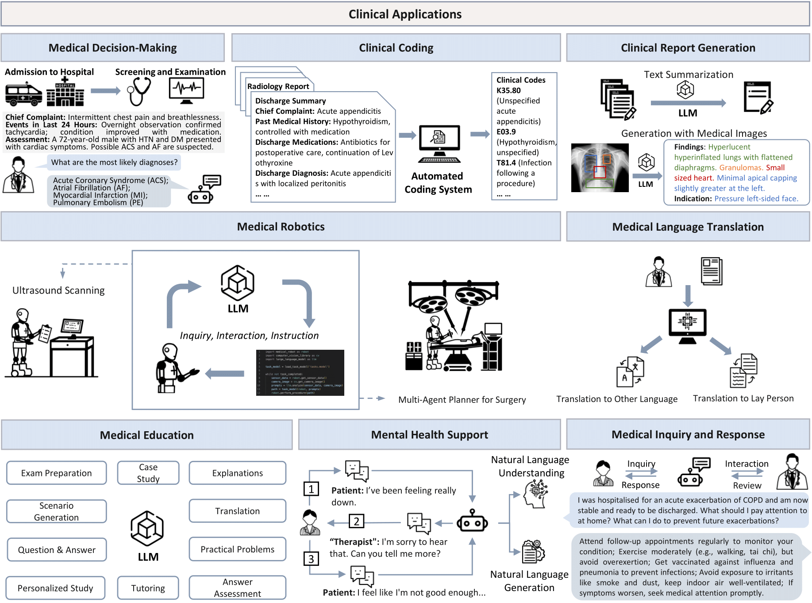
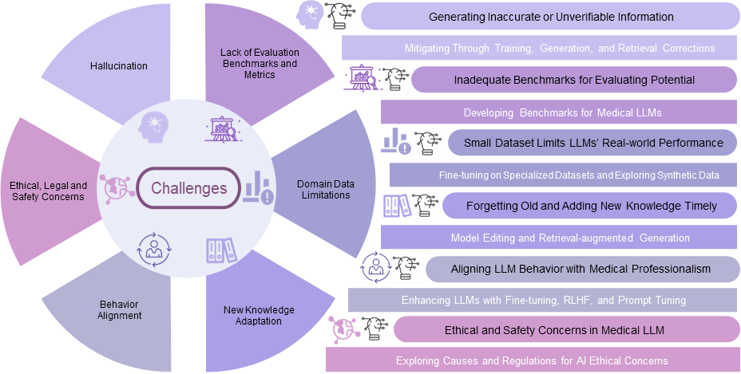
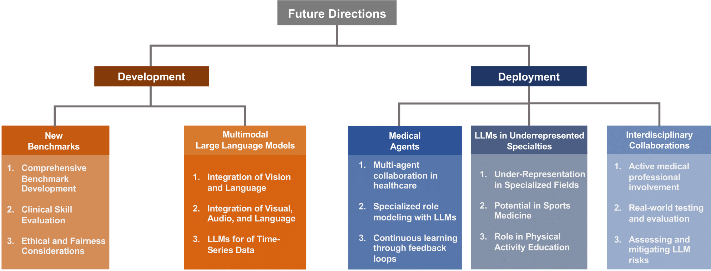

<div align=center>

</div>
<h2 align="center"> A Practical Guide for Medical Large Language Models </a></h2>
<h5 align="center"> If you like our project, please give us a star ⭐ on GitHub for the latest update.</h5>

<h5 align="center">


   [](https://awesome.re)
   [](https://arxiv.org/pdf/2311.05112.pdf)
   [](https://hits.seeyoufarm.com)
   [](https://x.com/omarsar0/status/1734599425568231513?s=20)
   [](https://mp.weixin.qq.com/s/gV3HHkVQXgR-Cego1P0ZBQ)
   [](https://www.youtube.com/watch?v=mSlKPzmW3Ac&t=23s)
   


</h5>

This is an actively updated list of practical guide resources for Medical Large Language Models (Medical LLMs). 
It's based on our survey paper: 

> [A Survey of Large Language Models in Medicine: Progress, Application, and Challenge](https://arxiv.org/abs/2311.05112)

> *Hongjian Zhou<sup>1,\*</sup>, Fenglin Liu<sup>1,\*</sup>, Boyang Gu<sup>2,\*</sup>, Xinyu Zou<sup>3,\*</sup>, Jinfa Huang<sup>4,\*</sup>, Jinge Wu<sup>5</sup>, Yiru Li<sup>6</sup>, Sam S. Chen<sup>7</sup>, Peilin Zhou<sup>8</sup>, Junling Liu<sup>9</sup>, Yining Hua<sup>10</sup>,
Chengfeng Mao<sup>11</sup>, Chenyu You<sup>12</sup>, Xian Wu<sup>13</sup>, Yefeng Zheng<sup>13</sup>, Lei Clifton<sup>1</sup>,
Zheng Li<sup>14,†</sup>, Jiebo Luo<sup>4,†</sup>, 
David A. Clifton<sup>1,†</sup>.* (\*Core Contributors, †Corresponding Authors)

> *<sup>1</sup>University of Oxford, <sup>2</sup>Imperial College London, <sup>3</sup>University of Waterloo,
<sup>4</sup>University of Rochester, <sup>5</sup>University College London, <sup>6</sup>Western University,
<sup>7</sup>University of Georgia, <sup>8</sup>Hong Kong University of Science and Technology (Guangzhou),
<sup>9</sup>Alibaba, <sup>10</sup>Harvard T.H. Chan School of Public Health, <sup>11</sup>MIT, <sup>12</sup>Yale University, <sup>13</sup>Tencent, <sup>14</sup>Amazon*

##  📣 Update News
[2024-10-11] 🎉🎉🎉 Big News! Our repository has reached 1,000 🌟. Thank you to everyone who contributed.

[2024-07-10] We have updated our [Version 6](https://arxiv.org/abs/2311.05112). Thank you all for your support!

[2024-05-05] We have updated our [Version 5](https://arxiv.org/abs/2311.05112). Please check it out!

[2024-03-03] We have updated our [Version 4](https://arxiv.org/abs/2311.05112). Please check it out!

[2024-02-04] 🍻🍻🍻 Cheers! Happy Chinese New Year! We have updated our [Version 3](https://arxiv.org/abs/2311.05112). Please check it out!

[2023-12-11] We have updated our survey [Version 2](https://arxiv.org/abs/2311.05112). Please check it out!

[2023-11-09] We have released the repository and survey [Version 1](https://arxiv.org/abs/2311.05112).

## ⚡ Contributing

If you want to add your work or model to this list, please do not hesitate to email fenglin.liu@eng.ox.ac.uk and jhuang90@ur.rochester.edu or [pull requests]([https://github.com/richard-peng-xia/awesome-multimodal-in-medical-imaging/pulls](https://github.com/AI-in-Health/MedLLMsPracticalGuide/pulls)).
Markdown format:

```markdown
* [**Name of Conference or Journal + Year**] Paper Name. [[paper]](link) [[code]](link)
```
## 🤔 What are the Goals of the Medical LLM?

**Goal 1: Surpassing Human-Level Expertise**.

<div align=center>

</div>

**Goal 2: Emergent Properties of Medical LLM with the Model Size Scaling Up**.

<div align=center>

</div>


## 🤗 What is This Survey About?
This survey provides a comprehensive overview of the principles, applications, and challenges faced by LLMs in medicine. We address the following specific questions: 
1.  How should medical LLMs be built? 
2.  What are the measures for the downstream performance of medical LLMs? 
3.  How should medical LLMs be utilized in real-world clinical practice? 
4.  What challenges arise from the use of medical LLMs? 
5.  How should we better construct and utilize medical LLMs? 

This survey aims to provide insights into the opportunities and challenges of LLMs in medicine, and serve as a practical resource for constructing effective medical LLMs. 

<div align=center>

</div>

## Table of Contents
- [📣 Update News](#-update-news)
- [⚡ Contributing](#-contributing)
- [🤔 What are the Goals of the Medical LLM?](#-what-are-the-goals-of-the-medical-llm)
- [🤗 What is This Survey About?](#-what-is-this-survey-about)
- [Table of Contents](#table-of-contents)
- [🔥 Practical Guide for Building Pipeline](#-practical-guide-for-building-pipeline)
  - [Pre-training from Scratch](#pre-training-from-scratch)
  - [Fine-tuning General LLMs](#fine-tuning-general-llms)
  - [Prompting General LLMs](#prompting-general-llms)
- [📊 Practical Guide for Medical Data](#-practical-guide-for-medical-data)
  - [Clinical Knowledge Bases](#clinical-knowledge-bases)
  - [Pre-training Data](#pre-training-data)
  - [Fine-tuning Data](#fine-tuning-data)
- [🗂️ Downstream Biomedical Tasks](#️-downstream-biomedical-tasks)
  - [Huggingface Leadboard](#huggingface-leadboard)
  - [Generative Tasks](#generative-tasks)
    - [Text Summarization](#text-summarization)
    - [Text Simplification](#text-simplification)
    - [Question Answering](#question-answering)
  - [Discriminative Tasks](#discriminative-tasks)
    - [Entity Extraction](#entity-extraction)
    - [Relation Extraction](#relation-extraction)
    - [Text Classification](#text-classification)
    - [Natural Language Inference](#natural-language-inference)
    - [Semantic Textual Similarity](#semantic-textual-similarity)
    - [Information Retrieval](#information-retrieval)
- [✨ Practical Guide for Clinical Applications](#-practical-guide-for-clinical-applications)
  - [Retrieval-augmented Generation](#retrieval-augmented-generation)
  - [Medical Decision-Making](#medical-decision-making)
  - [Clinical Coding](#clinical-coding)
  - [Clinical Report Generation](#clinical-report-generation)
  - [Medical Education](#medical-education)
  - [Medical Robotics](#medical-robotics)
  - [Medical Language Translation](#medical-language-translation)
  - [Mental Health Support](#mental-health-support)
- [⚔️ Practical Guide for Challenges](#️-practical-guide-for-challenges)
  - [Hallucination](#hallucination)
  - [Lack of Evaluation Benchmarks and Metrics](#lack-of-evaluation-benchmarks-and-metrics)
  - [Domain Data Limitations](#domain-data-limitations)
  - [New Knowledge Adaptation](#new-knowledge-adaptation)
  - [Behavior Alignment](#behavior-alignment)
  - [Ethical, Legal, and Safety Concerns](#ethical-legal-and-safety-concerns)
- [🚀 Practical Guide for Future Directions](#-practical-guide-for-future-directions)
  - [Introduction of New Benchmarks](#introduction-of-new-benchmarks)
  - [Interdisciplinary Collaborations](#interdisciplinary-collaborations)
  - [Multi-modal LLM](#multi-modal-llm)
  - [Medical Agents](#medical-agents)
- [👍 Acknowledgement](#-acknowledgement)
- [📑 Citation](#-citation)
- [♥️ Contributors](#️-contributors)

## 🔥 Practical Guide for Building Pipeline
<div align=center>

</div>

### Pre-training from Scratch
* [**Nature Medicine, 2024**] **BiomedGPT** A generalist vision–language foundation model for diverse biomedical tasks [paper](https://www.nature.com/articles/s41591-024-03185-2)
* [**Nature, 2023**] **NYUTron** Health system-scale language models are all-purpose prediction engines [paper](https://www.nature.com/articles/s41586-023-06160-y)
* [**Arxiv, 2023**] **OphGLM**: Training an Ophthalmology Large Language-and-Vision Assistant based on Instructions and Dialogue. [paper](https://arxiv.org/abs/2306.12174)
* [**npj Digital Medicine, 2023**] **GatorTronGPT**: A Study of Generative Large Language Model for Medical Research and Healthcare. [paper](https://arxiv.org/abs/2305.13523)
* [**Bioinformatics, 2023**] **MedCPT**: Contrastive Pre-trained Transformers with Large-scale Pubmed Search Logs for Zero-shot Biomedical Information Retrieval. [paper](https://arxiv.org/abs/2307.00589)
* [**Bioinformatics, 2022**] **BioGPT**: Generative Pre-trained Transformer for Biomedical Text Generation and Mining. [paper](https://academic.oup.com/bib/article-abstract/23/6/bbac409/6713511)
* [**NeurIPS, 2022**] **DRAGON**: Deep Bidirectional Language-Knowledge Graph Pretraining. [paper](https://arxiv.org/abs/2210.09338) [code](https://github.com/michiyasunaga/dragon)
* [**ACL, 2022**] **BioLinkBERT/LinkBERT**: Pretraining Language Models with Document Links. [paper](https://arxiv.org/abs/2203.15827) [code](https://github.com/michiyasunaga/LinkBERT)
* [**npj Digital Medicine, 2022**] **GatorTron**: A Large Language Model for Electronic Health Records. [paper](https://www.nature.com/articles/s41746-022-00742-2)
* [**HEALTH, 2021**] **PubMedBERT**: Domain-specific Language Model Pretraining for Biomedical Natural Language Processing. [paper](https://dl.acm.org/doi/abs/10.1145/3458754)
* [**Bioinformatics, 2020**] **BioBERT**: A Pre-trained Biomedical Language Representation Model for Biomedical Text Mining. [paper](https://academic.oup.com/bioinformatics/article-abstract/36/4/1234/5566506)
* [**ENNLP, 2019**] **SciBERT**: A Pretrained Language Model for Scientific Text. [paper](https://arxiv.org/abs/1903.10676)
* [**NAACL Workshop, 2019**] **ClinicalBERT**: Publicly Available Clinical BERT Embeddings. [paper](https://arxiv.org/abs/1904.03323)
* [**BioNLP Workshop, 2019**] **BlueBERT**: Transfer Learning in Biomedical Natural Language Processing: An Evaluation of BERT and ELMo on Ten Benchmarking Datasets. [paper](https://arxiv.org/abs/1906.05474)

### Fine-tuning General LLMs  
* [**Arxiv, 2024.8**] **Med42-v2**:  A Suite of Clinical LLMs. [paper](https://arxiv.org/pdf/2408.06142) [Model](https://huggingface.co/m42-health)
* [**JAMIA, 2024.5**] **Internist.ai 7b** Impact of high-quality, mixed-domain data on the performance of medical language models [paper](https://academic.oup.com/jamia/article-abstract/31/9/1875/7680487?redirectedFrom=fulltext) [Model](https://huggingface.co/internistai/base-7b-v0.2)
* [**Huggingface, 2024.5**] **OpenBioLLM-70b**: Advancing Open-source Large Language Models in Medical Domain [model](https://huggingface.co/aaditya/Llama3-OpenBioLLM-70B)
* [**Huggingface, 2024.5**] **MedLllama3** [model](https://huggingface.co/ProbeMedicalYonseiMAILab/medllama3-v20)
* [**Arxiv, 2024.5**] **Aloe**: A Family of Fine-tuned Open Healthcare LLMs. [paper](https://arxiv.org/abs/2405.01886) [Model](https://huggingface.co/collections/HPAI-BSC/healthcare-llms-aloe-family-6701b6a777f7e874a2123363)
* [**Arxiv, 2024.4**] **Med-Gemini** Capabilities of Gemini Models in Medicine. [paper](https://arxiv.org/pdf/2404.18416)
* [**Arxiv, 2024.2**] **BioMistral** A Collection of Open-Source Pretrained Large Language Models for Medical Domains. [paper](https://arxiv.org/pdf/2402.10373)
* [**Arxiv, 2023.12**] **From Beginner to Expert**: Modeling Medical Knowledge into General LLMs. [paper](https://arxiv.org/abs/2312.01040)
* [**Arxiv, 2023.11**] **Taiyi**: A Bilingual Fine-Tuned Large Language Model for Diverse Biomedical Tasks. [paper](https://arxiv.org/abs/2311.11608) [code](https://github.com/DUTIR-BioNLP/Taiyi-LLM)
* [**Arxiv, 2023.10**] **AlpaCare**: Instruction-tuned Large Language Models for Medical Application. [paper](https://arxiv.org/abs/2310.14558) [code](https://github.com/XZhang97666/AlpaCare)
* [**Arxiv, 2023.10**] **BianQue**: Balancing the Questioning and Suggestion Ability of Health LLMs with Multi-turn Health Conversations Polished by ChatGPT. [paper](https://arxiv.org/abs/2310.15896)
* [**Arxiv, 2023.10**] **Qilin-Med**: Multi-stage Knowledge Injection Advanced Medical Large Language Model. [paper](https://arxiv.org/abs/2310.09089)
* [**Arxiv, 2023.10**] **Qilin-Med-VL**: Towards Chinese Large Vision-Language Model for General Healthcare. [paper](https://arxiv.org/abs/2310.17956)
* [**Arxiv, 2023.10**] **MEDITRON-70B**: Scaling Medical Pretraining for Large Language Models. [paper](https://arxiv.org/abs/2311.16079)
* [**AAAI, 2024/2023.10**] **Med42**:  Evaluating Fine-Tuning Strategies for Medical LLMs: Full-Parameter vs. Parameter-Efficient Approaches. [paper](https://arxiv.org/abs/2404.14779) [Model](https://huggingface.co/m42-health/med42-70b)
* [**Arxiv, 2023.9**] **CPLLM**: Clinical Prediction with Large Language Models. [paper](https://arxiv.org/abs/2309.11295)
* [**Arxiv, 2023.8**] **BioMedGPT/OpenBioMed** Open Multimodal Generative Pre-trained Transformer for BioMedicine. [paper](https://arxiv.org/abs/2308.09442) [code](https://github.com/PharMolix/OpenBioMed)
* [**Nature Digital Medicine, 2023.8**] Large Language Models to Identify Social Determinants of Health in Electronic Health Records. [paper](https://arxiv.org/abs/2308.06354) [[code]](https://github.com/AIM-Harvard/SDoH)
* [**Arxiv, 2023.8**] **Zhongjing**: Enhancing the Chinese medical capabilities of large language model through expert feedback and real-world multi-turn dialogue. [paper](https://arxiv.org/abs/2308.03549)
* [**Arxiv, 2023.7**] **Med-Flamingo**: Med-Flamingo: a Multimodal Medical Few-shot Learner. [paper](https://arxiv.org/abs/2307.15189) [code](https://github.com/snap-stanford/med-flamingo)
* [**Arxiv, 2023.6**] **ClinicalGPT**: Large Language Models Finetuned with Diverse Medical Data and Comprehensive Evaluation. 2023. [paper](https://arxiv.org/abs/2306.09968)
* [**Cureus, 2023.6**] **ChatDoctor**: A Medical Chat Model Fine-Tuned on a Large Language Model Meta-AI (LLaMA) Using Medical Domain Knowledge. [paper](https://www.cureus.com/articles/152858-chatdoctor-a-medical-chat-model-fine-tuned-on-a-large-language-model-meta-ai-llama-using-medical-domain-knowledge.pdf)
* [**NeurIPS Datasets/Benchmarks Track, 2023.6**] **LLaVA-Med**: Training a large language-and-vision assistant for biomedicine in one day. [paper](https://arxiv.org/abs/2306.00890)
* [**Arxiv, 2023.6**] **MedPaLM 2**: Towards expert-level medical question answering with large language models. [paper](https://arxiv.org/abs/2305.09617)
* [**Arxiv, 2023.5**] **Clinical Camel**: An Open-Source Expert-Level Medical Language Model with Dialogue-Based Knowledge Encoding. [paper](https://arxiv.org/abs/2305.12031)
* [**Arxiv, 2023.5**] **BiomedGPT**: A Generalist Vision-Language Foundation Model for Diverse Biomedical Tasks. [paper]((https://arxiv.org/abs/2305.17100))
* [**Arxiv, 2023.5**] **HuatuoGPT**: HuatuoGPT, towards Taming Language Model to Be a Doctor. [paper](https://arxiv.org/abs/2305.15075)
* [**Arxiv, 2023.4**] **Baize-healthcare**: An open-source chat model with parameter-efficient tuning on self-chat data. [paper](https://arxiv.org/abs/2304.01196)
* [**Arxiv, 2023.4**] **Visual Med-Alpeca**: A parameter-efficient biomedical llm with visual capabilities. [github](https://github.com/cambridgeltl/visual-med-alpaca)
* [**Arxiv, 2023.4**] **PMC-LLaMA**: Further finetuning llama on medical papers. [paper](https://arxiv.org/abs/2304.14454)
* [**Arxiv, 2023.4**] **MedPaLM M**: Towards Generalist Biomedical AI. [paper](https://arxiv.org/abs/2307.14334) [code](https://github.com/kyegomez/Med-PaLM)
* [**Arxiv, 2023.4**] **BenTsao/Huatuo**: Tuning llama model with chinese medical knowledge. [paper](https://arxiv.org/abs/2304.06975)
* [**Github, 2023.4**] **ChatGLM-Med**: ChatGLM-Med: 基于中文医学知识的ChatGLM模型微调. [github](https://github.com/SCIR-HI/Med-ChatGLM)
* [**Arxiv, 2023.4**] **DoctorGLM**: Fine-tuning your chinese doctor is not a herculean task. [paper](https://arxiv.org/abs/2304.01097)

### Prompting General LLMs
* [**NEJM AI, 2024**] GPT-4 for Information Retrieval and Comparison of Medical Oncology Guidelines. [paper](https://ai.nejm.org/doi/abs/10.1056/AIcs2300235)
* [**Arxiv, 2023.11**] **MedPrompt**: Can Generalist Foundation Models Outcompete Special-Purpose Tuning? Case Study in Medicine. [paper](https://arxiv.org/abs/2311.16452)
* [**Arxiv, 2023.8**] **Dr. Knows**: Leveraging a medical knowledge graph into large language models for diagnosis prediction. [paper](https://arxiv.org/abs/2308.14321)
* [**Arxiv, 2023.3**] **DelD-GPT**: Zero-shot medical text de-identification by gpt-4. [paper](https://arxiv.org/abs/2303.11032) [code](https://github.com/yhydhx/ChatGPT-API)
* [**Arxiv, 2023.2/5**] **ChatCAD/ChatCAD+**: Interactive computer-aided diagnosis on medical image using large language models. [paper](https://arxiv.org/abs/2302.07257) [code](https://github.com/zhaozh10/ChatCAD)
* [**Nature, 2022.12**] **MedPaLM**: Large language models encode clinical knowledge. [paper](https://arxiv.org/abs/2212.13138)
* [**Arxiv, 2022.7/2023.12**] Can large language models reason about medical questions? [paper](https://arxiv.org/abs/2207.08143) 


## 📊 Practical Guide for Medical Data

### Clinical Knowledge Bases
* **[Drugs.com](https://www.drugs.com/)**
* **[DrugBank](https://go.drugbank.com/)**
* **[NHS Health](https://www.nhs.uk/conditions/)**
* **[NHS Medicine](https://www.nhs.uk/medicines/)**
* **[Unified Medical Language System (UMLS)](https://www.nlm.nih.gov/research/umls/index.html)**
* **[The Human Phenotype Ontology](https://hpo.jax.org/app/)**
* **[Center for Disease Control and Prevention](https://www.cdc.gov/)**
* **[National Institute for Health and Care Excellence](https://www.nice.org.uk/guidance)**
* **[World Health Organization](https://www.who.int/publications/who-guidelines)**

### Pre-training Data
* [**NEJM AI, 2024**] Clinical Text Datasets for Medical Artificial Intelligence and Large Language Models — A Systematic Review [paper](https://ai.nejm.org/doi/full/10.1056/AIra2400012)
* [**npj Digital Medicine, 2023**] **EHRs**: A Study of Generative Large Language Model for Medical Research and Healthcare. [paper](https://arxiv.org/abs/2305.13523)
* [**Arxiv, 2023**] **Guidelines**: A high-quality collection of clinical practice guidelines (CPGs) for the medical training of LLMs. [dataset](https://huggingface.co/datasets/epfl-llm/guidelines)
* [**Arxiv, 2023**] **GAP-REPLAY**: Scaling Medical Pretraining for Large Language Models. [paper](https://arxiv.org/abs/2311.16079)
* [**npj Digital Medicine, 2022**] **EHRs**: A large language model for electronic health records. [paper](https://www.nature.com/articles/s41746-022-00742-2)
* [**National Library of Medicine, 2022**] **PubMed**: National Institutes of Health. PubMed Data. [database](https://pubmed.ncbi.nlm.nih.gov/download/)
* [**Arxiv, 2020**] **PubMed**: The pile: An 800gb dataset of diverse text for language modeling. [paper](https://arxiv.org/abs/2101.00027) [code](https://github.com/EleutherAI/the-pile)
* [**EMNLP, 2020**] **MedDialog**: Meddialog: Two large-scale medical dialogue datasets. [paper](https://arxiv.org/abs/2004.03329) [code](https://github.com/UCSD-AI4H/Medical-Dialogue-System)
* [**NAACL, 2018**] **Literature**: Construction of the literature graph in semantic scholar. [paper](https://arxiv.org/abs/1805.02262)
* [**Scientific Data, 2016**] **MIMIC-III**: MIMIC-III, a freely accessible critical care database. [paper](https://www.nature.com/articles/sdata201635)

### Fine-tuning Data
* **MedTrinity-25M**: A Large-scale Multimodal Dataset with Multigranular Annotations for Medicine. 2024. [github](https://github.com/UCSC-VLAA/MedTrinity-25M) [paper](https://arxiv.org/abs/2408.02900)
* **cMeKG**: Chinese Medical Knowledge Graph. 2023. [github](https://github.com/king-yyf/CMeKG_tools)
* **CMD.**: Chinese medical dialogue data. 2023. [repo](https://github.com/Toyhom/Chinese-medical-dialogue-data)
* **BianQueCorpus**: BianQue: Balancing the Questioning and Suggestion Ability of Health LLMs with Multi-turn Health Conversations Polished by ChatGPT. 2023. [paper](https://arxiv.org/abs/2310.15896)
* **MD-EHR**: ClinicalGPT: Large Language Models Finetuned with Diverse Medical Data and Comprehensive Evaluation. 2023. [paper](https://arxiv.org/abs/2306.09968)
* **VariousMedQA**: Multi-scale attentive interaction networks for chinese medical question answer selection. 2018. [paper](https://ieeexplore.ieee.org/abstract/document/8548603/)
* **VariousMedQA**: What disease does this patient have? a large-scale open domain question answering dataset from medical exams. 2021. [paper](https://www.mdpi.com/2076-3417/11/14/6421)
* **MedDialog**: Meddialog: Two large-scale medical dialogue datasets. 2020. [paper](https://arxiv.org/abs/2004.03329)
* **ChiMed**: Qilin-Med: Multi-stage Knowledge Injection Advanced Medical Large Language Model. 2023. [paper](https://arxiv.org/abs/2310.09089)
* **ChiMed-VL**: Qilin-Med-VL: Towards Chinese Large Vision-Language Model for General Healthcare. 2023. [paper](https://arxiv.org/abs/2310.17956)
* **Healthcare Magic**: Healthcare Magic. [huggingface]([https://www.healthcaremagic.com/](https://huggingface.co/datasets/wangrongsheng/HealthCareMagic-100k-en))
* **ICliniq**: ICliniq. [platform](https://www.icliniq.com/)
* **Hybrid SFT**: HuatuoGPT, towards Taming Language Model to Be a Doctor. 2023. [paper](https://arxiv.org/abs/2305.15075)
* **PMC-15M**: Large-scale domain-specific pretraining for biomedical vision-language processing. 2023. [paper](https://arxiv.org/abs/2303.00915)
* **MedQuAD**: A question-entailment approach to question answering. 2019. [paper](https://bmcbioinformatics.biomedcentral.com/articles/10.1186/s12859-019-3119-4?ref=https://githubhelp.com)
* **VariousMedQA**: Visual med-alpaca: A parameter-efficient biomedical llm with visual capabilities. 2023. [repo](https://github.com/cambridgeltl/visual-med-alpaca)
* **CMtMedQA**:Zhongjing: Enhancing the Chinese medical capabilities of large language model through expert feedback and real-world multi-turn dialogue. 2023. [paper](https://arxiv.org/abs/2308.03549)
* **MTB**: Med-flamingo: a multimodal medical few-shot learner. 2023. [paper](https://arxiv.org/abs/2307.15189)
* **PMC-OA**: Pmc-clip: Contrastive language-image pre-training using biomedical documents. 2023. [paper](https://arxiv.org/abs/2303.07240)
* **Medical Meadow**: MedAlpaca--An Open-Source Collection of Medical Conversational AI Models and Training Data. 2023. [paper](https://arxiv.org/abs/2304.08247)
* **Literature**: S2ORC: The semantic scholar open research corpus. 2019. [paper](https://arxiv.org/abs/1911.02782)
* **MedC-I**: Pmc-llama: Further finetuning llama on medical papers. 2023. [paper](https://arxiv.org/abs/2304.14454)
* **ShareGPT**: Sharegpt. 2023. [platform](https://sharegpt.com/)
* **PubMed**: National Institutes of Health. PubMed Data. In National Library of Medicine. 2022. [database](https://pubmed.ncbi.nlm.nih.gov/download/)
* **MedQA**: What disease does this patient have? a large-scale open domain question answering dataset from medical exams. 2021. [paper](https://www.mdpi.com/2076-3417/11/14/6421)
* **MultiMedQA**: Towards expert-level medical question answering with large language models. 2023. [paper](https://arxiv.org/abs/2305.09617)
* **MultiMedBench**: Towards generalist biomedical ai. 2023. [paper](https://arxiv.org/abs/2307.14334)
* **MedInstruct-52**: Instruction-tuned Large Language Models for Medical Application. 2023. [paper](https://arxiv.org/abs/2310.14558)
* **eICU-CRD**: The eicu collaborative research database, a freely available multi-center database for critical care research. 2018. [paper](https://www.nature.com/articles/sdata2018178)
* **MIMIC-IV**: MIMIC-IV, a freely accessible electronic health record dataset. 2023. [paper](https://www.nature.com/articles/s41597-022-01899-x) [database](https://physionet.org/content/mimiciv/2.2/)
* **PMC-Patients**: 167k open patient summaries. 2023. [paper](https://arxiv.org/abs/2202.13876) [database](https://huggingface.co/datasets/zhengyun21/PMC-Patients)
  
## 🗂️ Downstream Biomedical Tasks

<div align=center>

</div>

### Huggingface Leaderboard
* **Open Medical-LLM Leaderboard**: MedQA (USMLE), PubMedQA, MedMCQA, and subsets of MMLU related to medicine and biology.  [Leaderboard](https://huggingface.co/spaces/openlifescienceai/open_medical_llm_leaderboard)
* **ReXrank**: A Public Leaderboard for AI-Powered Radiology Report Generation [paper](https://arxiv.org/abs/2411.15122/) [[paper]] [[code]] (https://github.com/rajpurkarlab/ReXrank)
### Generative Tasks

#### Text Summarization
* **PubMed**: National Institutes of Health. PubMed Data. In National Library of Medicine. [database](https://pubmed.ncbi.nlm.nih.gov/download/)
* **PMC**: National Institutes of Health. PubMed Central Data. In National Library of Medicine. [database](https://www.ncbi.nlm.nih.gov/pmc/)
* **CORD-19**: Cord-19: The covid-19 open research dataset 2020. [paper](https://www.ncbi.nlm.nih.gov/pmc/articles/PMC7251955/)
* **MentSum**: Mentsum: A resource for exploring summarization of mental health online posts 2022. [paper](https://arxiv.org/abs/2206.00856)
* **MeQSum**: On the summarization of consumer health questions 2019. [paper](https://aclanthology.org/P19-1215/)
* **MedQSum**: Enhancing Large Language Models’ Utility for Medical Question-Answering: A Patient Health Question Summarization Approach. [[paper]](https://doi.org/10.1109/SITA60746.2023.10373720) [[code]](https://github.com/zekaouinoureddine/MedQSum)

#### Text Simplification
* **MultiCochrane**: Multilingual Simplification of Medical Texts 2023. [paper](https://arxiv.org/abs/2305.12532)
* **AutoMeTS**: AutoMeTS: the autocomplete for medical text simplification 2020. [paper](https://arxiv.org/abs/2010.10573)

#### Question Answering
* **CareQA**: CareQA: A multichoice question answering dataset based on the access exam for Spanish Specialised Healthcare Training (FSE).[paper](https://arxiv.org/abs/2405.01886) [dataset](https://huggingface.co/datasets/HPAI-BSC/CareQA)
* **BioASQ-QA**: BioASQ-QA: A manually curated corpus for Biomedical Question Answering 2023. [paper](https://www.nature.com/articles/s41597-023-02068-4)
* **emrQA**: emrqa: A large corpus for question answering on electronic medical records 2018. [paper](https://arxiv.org/abs/1809.00732)
* **CliCR**: CliCR: a dataset of clinical case reports for machine reading comprehension 2018. [paper](https://arxiv.org/abs/1803.09720)
* **PubMedQA**: Pubmedqa: A dataset for biomedical research question answering 2019. [paper](https://arxiv.org/abs/1909.06146)
* **COVID-QA**: COVID-QA: A question answering dataset for COVID-19 2020. [paper](https://aclanthology.org/2020.nlpcovid19-acl.18/)
* **MASH-QA**: Question answering with long multiple-span answers 2020. [paper](https://aclanthology.org/2020.findings-emnlp.342/)
* **Health-QA**: A hierarchical attention retrieval model for healthcare question answering 2019. [paper](https://dl.acm.org/doi/abs/10.1145/3308558.3313699)
* **MedQA**: What disease does this patient have? a large-scale open domain question answering dataset from medical exams 2021. [paper](https://www.mdpi.com/2076-3417/11/14/6421)
* **MedMCQA**: Medmcqa: A large-scale multi-subject multi-choice dataset for medical domain question answering 2022. [paper](https://proceedings.mlr.press/v174/pal22a.html)
* **MMLU (Clinical Knowledge)**: Measuring massive multitask language understanding 2020. [paper](https://arxiv.org/abs/2009.03300)
* **MMLU (College Medicine)**: Measuring massive multitask language understanding 2020. [paper](https://arxiv.org/abs/2009.03300)
* **MMLU (Professional Medicine)**: Measuring massive multitask language understanding 2020. [paper](https://arxiv.org/abs/2009.03300)
* [**Arxiv 2024**] MediQ: Question-Asking LLMs for Adaptive and Reliable Clinical Reasoning. [[paper]](https://arxiv.org/abs/2406.00922) [[code]](https://github.com/stellalisy/MediQ).

### Discriminative Tasks

#### Entity Extraction
* [**Arxiv, 2024.10**] Named Clinical Entity Recognition Benchmark [paper](https://arxiv.org/abs/2410.05046) [Leaderboard](https://huggingface.co/spaces/m42-health/clinical_ner_leaderboard)
* **NCBI Disease**: NCBI disease corpus: a resource for disease name recognition and concept normalization 2014. [paper](https://www.sciencedirect.com/science/article/pii/S1532046413001974)
* **JNLPBA**: Introduction to the bio-entity recognition task at JNLPBA 2004. [paper](https://aclanthology.org/W04-1213.pdf)
* **GENIA**: GENIA corpus--a semantically annotated corpus for bio-textmining 2003. [paper](https://www.researchgate.net/profile/Jin-Dong-Kim-2/publication/10667350_GENIA_corpus-A_semantically_annotated_corpus_for_bio-textmining/links/00b49520d9a33ae419000000/GENIA-corpus-A-semantically-annotated-corpus-for-bio-textmining.pdf)
* **BC5CDR**: BioCreative V CDR task corpus: a resource for chemical disease relation extraction 2016. [paper](https://academic.oup.com/database/article/doi/10.1093/database/baw068/2630414?ref=https%3A%2F%2Fgithubhelp.com&login=true)
* **BC4CHEMD**: The CHEMDNER corpus of chemicals and drugs and its annotation principles 2015. [paper](https://jcheminf.biomedcentral.com/articles/10.1186/1758-2946-7-S1-S2)
* **BioRED**: BioRED: a rich biomedical relation extraction dataset 2022. [paper](https://academic.oup.com/bib/article-abstract/23/5/bbac282/6645993)
* **CMeEE**: Cblue: A chinese biomedical language understanding evaluation benchmark 2021. [paper](https://arxiv.org/abs/2106.08087)
* **NLM-Chem-BC7**: NLM-Chem-BC7: manually annotated full-text resources for chemical entity annotation and indexing in biomedical articles 2022. [paper](https://academic.oup.com/database/article-abstract/doi/10.1093/database/baac102/6858529)
* **ADE**: Development of a benchmark corpus to support the automatic extraction of drug-related adverse effects from medical case reports 2012. [paper](https://www.sciencedirect.com/science/article/pii/S1532046412000615)
* **2012 i2b2**: Evaluating temporal relations in clinical text: 2012 i2b2 challenge 2013. [paper](https://academic.oup.com/jamia/article-abstract/20/5/806/726374)
* **2014 i2b2/UTHealth (Track 1)**: Annotating longitudinal clinical narratives for de-identification: The 2014 i2b2/UTHealth corpus 2015. [paper](https://www.sciencedirect.com/science/article/pii/S1532046415001823)
* **2018 n2c2 (Track 2)**: 2018 n2c2 shared task on adverse drug events and medication extraction in electronic health records 2020. [paper](https://academic.oup.com/jamia/article-abstract/27/1/3/5581277)
* **Cadec**: Cadec: A corpus of adverse drug event annotations 2015. [paper](https://www.sciencedirect.com/science/article/pii/S1532046415000532)
* **DDI**: Semeval-2013 task 9: Extraction of drug-drug interactions from biomedical texts (ddiextraction 2013) 2013. [paper](https://e-archivo.uc3m.es/handle/10016/20455)
* **PGR**: A silver standard corpus of human phenotype-gene relations 2019. [paper](https://arxiv.org/abs/1903.10728)
* **EU-ADR**: The EU-ADR corpus: annotated drugs, diseases, targets, and their relationships 2012. [paper](https://www.sciencedirect.com/science/article/pii/S1532046412000573)
* [**BioCreative VII Challenge, 2021**] Medications detection in tweets using transformer networks and multi-task learning. [[paper]]( https://arxiv.org/abs/2111.13726) [[code]]( https://github.com/Machine-Learning-for-Medical-Language/SMMH-Medication-Detection)

#### Relation Extraction
* **BC5CDR**: BioCreative V CDR task corpus: a resource for chemical disease relation extraction 2016. [paper](https://academic.oup.com/database/article/doi/10.1093/database/baw068/2630414?ref=https%3A%2F%2Fgithubhelp.com&login=true)
* **BioRED**: BioRED: a rich biomedical relation extraction dataset 2022. [paper](https://academic.oup.com/bib/article-abstract/23/5/bbac282/6645993)
* **ADE**: Development of a benchmark corpus to support the automatic extraction of drug-related adverse effects from medical case reports 2012. [paper](https://www.sciencedirect.com/science/article/pii/S1532046412000615)
* **2018 n2c2 (Track 2)**: 2018 n2c2 shared task on adverse drug events and medication extraction in electronic health records 2020. [paper](https://academic.oup.com/jamia/article-abstract/27/1/3/5581277)
* **2010 i2b2/VA**: 2010 i2b2/VA challenge on concepts, assertions, and relations in clinical text 2011. [paper](https://academic.oup.com/jamia/article-abstract/18/5/552/830538)
* **ChemProt**: Overview of the BioCreative VI chemical-protein interaction Track 2017. [database](https://biocreative.bioinformatics.udel.edu/news/corpora/chemprot-corpus-biocreative-vi/)
* **GDA**: Renet: A deep learning approach for extracting gene-disease associations from literature 2019. [paper](https://link.springer.com/chapter/10.1007/978-3-030-17083-7_17)
* **DDI**: Semeval-2013 task 9: Extraction of drug-drug interactions from biomedical texts (ddiextraction 2013) 2013. [paper](https://e-archivo.uc3m.es/handle/10016/20455)
* **GAD**: The genetic association database 2004. [paper](https://www.nature.com/articles/ng0504-431)
* **2012 i2b2**: Evaluating temporal relations in clinical text: 2012 i2b2 challenge 2013. [paper](https://academic.oup.com/jamia/article-abstract/20/5/806/726374)
* **PGR**: A silver standard corpus of human phenotype-gene relations 2019. [paper](https://arxiv.org/abs/1903.10728)
* **EU-ADR**: The EU-ADR corpus: annotated drugs, diseases, targets, and their relationships 2012. [paper](https://www.sciencedirect.com/science/article/pii/S1532046412000573)

#### Text Classification
* **ADE**: Development of a benchmark corpus to support the automatic extraction of drug-related adverse effects from medical case reports 2012. [paper](https://www.sciencedirect.com/science/article/pii/S1532046412000615)
* **2014 i2b2/UTHealth (Track 2)**: Annotating longitudinal clinical narratives for de-identification: The 2014 i2b2/UTHealth corpus 2015. [paper](https://www.sciencedirect.com/science/article/pii/S1532046415001823)
* **HoC**: Automatic semantic classification of scientific literature according to the hallmarks of cancer 2016. [paper](https://academic.oup.com/bioinformatics/article-abstract/32/3/432/1743783)
* **OHSUMED**: OHSUMED: An interactive retrieval evaluation and new large test collection for research 1994. [paper](https://link.springer.com/chapter/10.1007/978-1-4471-2099-5_20)
* **WNUT-2020 Task 2**: WNUT-2020 task 2: identification of informative COVID-19 english tweets 2020. [paper](https://arxiv.org/abs/2010.08232)
* **Medical Abstracts**: Evaluating unsupervised text classification: zero-shot and similarity-based approaches 2022. [paper](https://arxiv.org/abs/2211.16285)
* **MIMIC-III**: MIMIC-III, a freely accessible critical care database 2016. [paper](https://www.nature.com/articles/sdata201635)

#### Natural Language Inference
* **MedNLI**: Lessons from natural language inference in the clinical domain 2018. [paper](https://arxiv.org/abs/1808.06752)
* **BioNLI**: BioNLI: Generating a Biomedical NLI Dataset Using Lexico-semantic Constraints for Adversarial Examples 2022. [paper](https://arxiv.org/abs/2210.14814)

#### Semantic Textual Similarity
* **MedSTS**: MedSTS: a resource for clinical semantic textual similarity 2020. [paper](https://link.springer.com/article/10.1007/s10579-018-9431-1)
* **2019 n2c2/OHNLP**: The 2019 n2c2/ohnlp track on clinical semantic textual similarity: overview 2020. [paper](https://medinform.jmir.org/2020/11/e23375)
* **BIOSSES**: BIOSSES: a semantic sentence similarity estimation system for the biomedical domain 2017. [paper](https://academic.oup.com/bioinformatics/article-abstract/33/14/i49/3953954)

#### Information Retrieval
* **TREC-COVID**: TREC-COVID: constructing a pandemic information retrieval test collection 2021. [paper](https://dl.acm.org/doi/abs/10.1145/3451964.3451965)
* **NFCorpus**: A full-text learning to rank dataset for medical information retrieval 2016. [paper](https://link.springer.com/chapter/10.1007/978-3-319-30671-1_58)
* **BioASQ (BEIR)**: A heterogenous benchmark for zero-shot evaluation of information retrieval models 2021. [paper](https://arxiv.org/abs/2104.08663)

## ✨ Practical Guide for Clinical Applications

<div align=center>

</div>

### Retrieval-augmented Generation
* [**Arxiv, 2024**] Medical Graph RAG: Towards Safe Medical Large Language Model via Graph Retrieval-Augmented Generation. [paper](https://arxiv.org/pdf/2408.04187v1)
* [**NEJM AI, 2024**] GPT-4 for Information Retrieval and Comparison of Medical Oncology Guidelines. [paper](https://ai.nejm.org/doi/abs/10.1056/AIcs2300235)
* [**Arxiv, 2023**] Think and Retrieval: A Hypothesis Knowledge Graph Enhanced Medical Large Language Models. [paper](https://arxiv.org/pdf/2312.15883.pdf)
* [**JASN, 2023**] Retrieve, Summarize, and Verify: How Will ChatGPT Affect Information Seeking from the Medical Literature? [paper](https://journals.lww.com/jasn/fulltext/2023/08000/retrieve,_summarize,_and_verify__how_will_chatgpt.4.aspx)

### Medical Decision-Making
* [**Nature, 2023**] **NYUTron** Health system-scale language models are all-purpose prediction engines [paper](https://www.nature.com/articles/s41586-023-06160-y)
* [**Arxiv, 2023**] Leveraging a medical knowledge graph into large language models for diagnosis prediction. [paper](https://arxiv.org/abs/2308.14321)
* [**Arxiv, 2023**] ChatCAD+/Chatcad: Interactive computer-aided diagnosis on medical image using large language models. [paper](https://arxiv.org/abs/2302.07257) [code](https://github.com/zhaozh10/ChatCAD)
* [**Cancer Inform, 2023**] Designing a Deep Learning-Driven Resource-Efficient Diagnostic System for Metastatic Breast Cancer: Reducing Long Delays of Clinical Diagnosis and Improving Patient Survival in Developing Countries. [paper](https://arxiv.org/abs/2308.02597)
* [**Nature Medicine, 2023**] Large language models in medicine. [paper](https://www.nature.com/articles/s41591-023-02448-8)
* [**Nature Medicine, 2022**] AI in health and medicine. [paper](https://www.nature.com/articles/s41591-021-01614-0)

### Clinical Coding
* [**NEJM AI, 2024**] Large Language Models Are Poor Medical Coders — Benchmarking of Medical Code Querying. [paper](https://ai.nejm.org/doi/full/10.1056/AIdbp2300040)
* [**JMAI, 2023**] Applying large language model artificial intelligence for retina International Classification of Diseases (ICD) coding. [paper](https://jmai.amegroups.org/article/view/8198/html)
* [**ClinicalNLP Workshop, 2022**] PLM-ICD: automatic ICD coding with pretrained language models. [paper](https://arxiv.org/abs/2207.05289) [code](https://github.com/MiuLab/PLM-ICD)

### Clinical Report Generation
* [**Nature Medicine, 2024**] Adapted large language models can outperform medical experts in clinical text summarization. [paper](https://www.nature.com/articles/s41591-024-02855-5)
* [**Arxiv, 2023**] Can GPT-4V (ision) Serve Medical Applications? Case Studies on GPT-4V for Multimodal Medical Diagnosis. [paper](https://arxiv.org/abs/2310.09909)
* [**Arxiv, 2023**] Qilin-Med-VL: Towards Chinese Large Vision-Language Model for General Healthcare. [paper](https://arxiv.org/abs/2310.17956)
* [**Arxiv, 2023**] Customizing General-Purpose Foundation Models for Medical Report Generation. [paper](https://arxiv.org/abs/2306.05642)
* [**Arxiv, 2023**] Towards generalist foundation model for radiology. [paper](https://arxiv.org/abs/2308.02463) [code](https://github.com/chaoyi-wu/RadFM)
* [**Arxiv, 2023**] Clinical Text Summarization: Adapting Large Language Models Can Outperform Human Experts. 2023. [paper](https://arxiv.org/abs/2309.07430) [project](https://stanfordmimi.github.io/clin-summ/) [code](https://github.com/StanfordMIMI/clin-summ)
* [**Arxiv, 2023**] MAIRA-1: A specialised large multimodal model for radiology report generation. [paper](https://arxiv.org/abs/2311.13668) [project](https://www.microsoft.com/en-us/research/project/project-maira/)
* [**Arxiv, 2023**] Consensus, dissensus and synergy between clinicians and specialist foundation models in radiology report generation. [paper](https://arxiv.org/pdf/2311.18260.pdf)
* [**Lancet Digit Health, 2023**] Using ChatGPT to write patient clinic letters. [paper](https://www.thelancet.com/journals/landig/article/PIIS2589-7500(23)00048-1/fulltext)
* [**Lancet Digit Health, 2023**] ChatGPT: the future of discharge summaries?. [paper](https://www.thelancet.com/journals/landig/article/PIIS2589-7500(23)00021-3/fulltext)
* [**Arxiv, 2023.2/5**] **ChatCAD/ChatCAD+**: Interactive computer-aided diagnosis on medical image using large language models. [paper](https://arxiv.org/abs/2302.07257) [code](https://github.com/zhaozh10/ChatCAD)

### Medical Education
* [**JMIR, 2023**] Large Language Models in Medical Education: Opportunities, Challenges, and Future Directions. [paper](https://mededu.jmir.org/2023/1/e48291/)
* [**JMIR, 2023**] The Advent of Generative Language Models in Medical Education. [paper](https://mededu.jmir.org/2023/1/e48163)
* [**Korean J Med Educ., 2023**] The impending impacts of large language models on medical education. [paper](https://www.ncbi.nlm.nih.gov/pmc/articles/PMC10020064/)
* [**Healthcare, 2023**]Leveraging Generative AI and Large Language Models: A Comprehensive Roadmap for Healthcare Integration. [paper](https://www.ncbi.nlm.nih.gov/pmc/articles/PMC10606429/)

### Medical Robotics
* [**ICARM, 2023**] A Nested U-Structure for Instrument Segmentation in Robotic Surgery. [paper](https://ieeexplore.ieee.org/abstract/document/10218893/)
* [**Appl. Sci., 2023**] The multi-trip autonomous mobile robot scheduling problem with time windows in a stochastic environment at smart hospitals. [paper](https://www.mdpi.com/2076-3417/13/17/9879)
* [**Arxiv, 2023**] GRID: Scene-Graph-based Instruction-driven Robotic Task Planning. [paper](https://arxiv.org/abs/2309.07726)
* [**I3CE, 2023**] Trust in Construction AI-Powered Collaborative Robots: A Qualitative Empirical Analysis. [paper](https://arxiv.org/abs/2308.14846)
* [**STAR, 2016**] Advanced robotics for medical rehabilitation.  [paper](https://link.springer.com/content/pdf/10.1007/978-3-319-19896-5.pdf)

### Medical Language Translation
* [**New Biotechnology, 2023**] Machine translation of standardised medical terminology using natural language processing: A Scoping Review. [paper](https://www.sciencedirect.com/science/article/pii/S1871678423000432)
* [**JMIR, 2023**] The Advent of Generative Language Models in Medical Education. [paper](https://mededu.jmir.org/2023/1/e48163)

### Mental Health Support
* [**Arxiv, 2024**] Large Language Models in Mental Health Care: a Scoping Review. [paper](https://arxiv.org/abs/2401.02984)
* [**Arxiv, 2023**] PsyChat: A Client-Centric Dialogue System for Mental Health Support. [paper](https://arxiv.org/abs/2312.04262) [code](https://github.com/qiuhuachuan/PsyChat)
* [**Arxiv, 2023**] Benefits and Harms of Large Language Models in Digital Mental Health. [paper](https://arxiv.org/abs/2311.14693)
* [**CIKM, 2023**] ChatCounselor: A Large Language Models for Mental Health Support. [paper](https://arxiv.org/abs/2309.15461) [code](https://github.com/EmoCareAI/ChatPsychiatrist)
* [**HCII, 2023**] Tell me, what are you most afraid of? Exploring the Effects of Agent Representation on Information Disclosure in Human-Chatbot Interaction. [paper](https://link.springer.com/chapter/10.1007/978-3-031-35894-4_13)
* [**IJSR, 2023**] A Brief Wellbeing Training Session Delivered by a Humanoid Social Robot: A Pilot Randomized Controlled Trial. [paper](https://link.springer.com/article/10.1007/s12369-023-01054-5)
* [**CHB, 2015**] Real conversations with artificial intelligence: A comparison between human–human online conversations and human–chatbot conversations. [paper](https://www.sciencedirect.com/science/article/pii/S0747563215001247)

## ⚔️ Practical Guide for Challenges

<div align=center>

</div>

### Hallucination
* [**Arxiv, 2024**] Chain-of-verification reduces hallucination in large language models. [paper](https://arxiv.org/abs/2309.11495)
* [**ACM Computing Surveys, 2023**] Survey of hallucination in natural language generation. [paper](https://dl.acm.org/doi/abs/10.1145/3571730)
* [**EMNLP, 2023**] Med-halt: Medical domain hallucination test for large language models. [paper](https://arxiv.org/abs/2307.15343)
* [**Arxiv, 2023**] A survey of hallucination in large foundation models. 2023. [paper](https://arxiv.org/abs/2309.05922) [code](https://github.com/vr25/hallucination-foundation-model-survey)
* [**EMNLP, 2023**] Selfcheckgpt: Zero-resource black-box hallucination detection for generative large language models. 2023. [paper](https://arxiv.org/abs/2303.08896)
* [**EMNLP Findings, 2021**] Retrieval augmentation reduces hallucination in conversation. 2021. [paper](https://arxiv.org/abs/2104.07567)


### Lack of Evaluation Benchmarks and Metrics
* [**Blog, 2024.11**] SymptomCheck Bench. [blog](https://medask.tech/blogs/introducing-symptomcheck-bench/) [code](https://github.com/medaks/symptomcheck-bench)
* [**EMNLP, 2024**] A Metric for Radiology Report Generation. [paper](https://arxiv.org/pdf/2406.16845)
* [**Arxiv, 2024**] GMAI-MMBench: A Comprehensive Multimodal Evaluation Benchmark Towards General Medical AI. [paper](https://arxiv.org/abs/2408.03361)
* [**Arxiv, 2024**] Large Language Models in the Clinic: A Comprehensive Benchmark. [paper](https://arxiv.org/abs/2405.00716)
* [**Nature Reviews Bioengineering, 2023**] Benchmarking medical large language models. [paper](https://www.nature.com/articles/s44222-023-00097-7)
* [**Bioinformatics, 2023**] An extensive benchmark study on biomedical text generation and mining with ChatGPT. [paper](https://academic.oup.com/bioinformatics/article/39/9/btad557/7264174)
* [**Arxiv, 2023**] Large language models in biomedical natural language processing: benchmarks, baselines, and recommendations. [paper](https://arxiv.org/abs/2305.16326)
* [**ACL, 2023**] HaluEval: A Large-Scale Hallucination Evaluation Benchmark for Large Language Models. [paper](https://ui.adsabs.harvard.edu/abs/2023arXiv230511747L/abstract) [code](https://github.com/RUCAIBox/HaluEval)
* [**ACL, 2022**] Truthfulqa: Measuring how models mimic human falsehoods. [paper](https://arxiv.org/abs/2109.07958)
* [**Appl. Sci, 2021**] What disease does this patient have? a large-scale open domain question answering dataset from medical exams. [paper](https://www.mdpi.com/2076-3417/11/14/6421)

### Domain Data Limitations
* [**Arxiv, 2023**] Textbooks Are All You Need. [paper](https://arxiv.org/abs/2306.11644)
* [**Arxiv, 2023**] Model Dementia: Generated Data Makes Models Forget. [paper](https://arxiv.org/abs/2305.17493)

### New Knowledge Adaptation
* [**ACL Findings, 2023**] Detecting Edit Failures In Large Language Models: An Improved Specificity Benchmark. [paper](https://arxiv.org/abs/2305.17553)
* [**EMNLP, 2023**] Editing Large Language Models: Problems, Methods, and Opportunities. [paper](https://arxiv.org/abs/2305.13172)
* [**NeurIPS, 2020**] Retrieval-augmented generation for knowledge-intensive nlp tasks. [paper](https://proceedings.neurips.cc/paper/2020/hash/6b493230205f780e1bc26945df7481e5-Abstract.html)

### Behavior Alignment
* [**JMIR Medical Education, 2023**] Differentiate ChatGPT-generated and Human-written Medical Texts. [paper](https://arxiv.org/abs/2304.11567)
* [**Arxiv, 2023**] Languages are rewards: Hindsight finetuning using human feedback. [paper](https://arxiv.org/abs/2302.02676) [code](https://github.com/lhao499/chain-of-hindsight)
* [**Arxiv, 2022**] Training a helpful and harmless assistant with reinforcement learning from human feedback. [paper](https://arxiv.org/abs/2204.05862) [code](https://github.com/anthropics/hh-rlhf)
* [**Arxiv, 2022**] Improving alignment of dialogue agents via targeted human judgements. [paper](https://arxiv.org/abs/2209.14375)
* [**ICLR, 2021**] Aligning AI with shared human values.  [paper](https://arxiv.org/abs/2008.02275) [code](https://github.com/hendrycks/ethics/)
* [**Arxiv, 2021.12**] Webgpt: Browser-assisted question-answering with human feedback. [paper](https://arxiv.org/abs/2112.09332)


### Ethical, Legal, and Safety Concerns
* [**Arxiv, 2023.10**] A Survey of Large Language Models for Healthcare: from Data, Technology, and Applications to Accountability and Ethics. [paper](https://arxiv.org/abs/2310.05694)
* [**Arxiv, 2023.8**] "Do Anything Now": Characterizing and Evaluating In-The-Wild Jailbreak Prompts on Large Language Models. [paper](https://arxiv.org/abs/2308.03825) [code](https://github.com/verazuo/jailbreak_llms)
* [**NeurIPS, 2023.7**] Jailbroken: How does llm safety training fail?. [paper](https://arxiv.org/abs/2307.02483)
* [**EMNLP, 2023.4**] Multi-step jailbreaking privacy attacks on chatgpt. [paper](https://arxiv.org/abs/2304.05197)
* [**Healthcare, 2023.3**] ChatGPT utility in healthcare education, research, and practice: systematic review on the promising perspectives and valid concerns. [paper](https://www.mdpi.com/2227-9032/11/6/887)
* [**Nature News, 2023.1**] ChatGPT listed as author on research papers: many scientists disapprove. [paper](https://ui.adsabs.harvard.edu/abs/2023Natur.613..620S/abstract)

## 🚀 Practical Guide for Future Directions

<div align=center>

</div>

### Introduction of New Benchmarks
* [**Blog, 2024.11**] SymptomCheck Bench. [blog](https://medask.tech/blogs/introducing-symptomcheck-bench/) [code](https://github.com/medaks/symptomcheck-bench) 
* [**Arxiv, 2023.12**] Designing Guiding Principles for NLP for Healthcare: A Case Study of Maternal Health. [paper](https://arxiv.org/abs/2312.11803)
* [**JCO CCI, 2023**] Natural language processing to automatically extract the presence and severity of esophagitis in notes of patients undergoing radiotherapy. [[paper]]( https://pubmed.ncbi.nlm.nih.gov/37506330/) [[code]]( https://github.com/AIM-Harvard/Eso_alpha)
* [**JAMA ONC, 2023**] Use of Artificial Intelligence Chatbots for Cancer Treatment Information. [[paper]]( https://jamanetwork.com/journals/jamaoncology/fullarticle/2808731) [[code]]( https://github.com/AIM-Harvard/ChatGPT_NCCN)
* [**BioRxiv, 2023**] A comprehensive benchmark study on biomedical text generation and mining with ChatGPT. [paper](https://www.biorxiv.org/content/10.1101/2023.04.19.537463.abstract)
* [**JAMA, 2023**] Creation and adoption of large language models in medicine. [paper](https://jamanetwork.com/journals/jama/article-abstract/2808296)
* [**Arxiv, 2023**] Large Language Models in Sport Science & Medicine: Opportunities, Risks and Considerations. [paper](https://arxiv.org/abs/2305.03851)


### Interdisciplinary Collaborations
* [**JAMA, 2023**] Creation and adoption of large language models in medicine. 2023. [paper](https://jamanetwork.com/journals/jama/article-abstract/2808296)
* [**JAMA Forum, 2023**] ChatGPT and Physicians' Malpractice Risk. [paper](https://jamanetwork.com/journals/jama-health-forum/fullarticle/2805334)

### Multi-modal LLM
* [**Nature Medicine, 2024**] **BiomedGPT** A generalist vision–language foundation model for diverse biomedical tasks [paper](https://www.nature.com/articles/s41591-024-03185-2)
* [**Arxiv, 2023**] VisionFM: a Multi-Modal Multi-Task Vision Foundation Model for Generalist Ophthalmic Artificial Intelligence. [paper](https://arxiv.org/abs/2310.04992)
* [**Arxiv, 2023**] A Survey on Multimodal Large Language Models. [paper](https://arxiv.org/abs/2306.13549)
* [**Arxiv, 2023**] Mm-react: Prompting chatgpt for multimodal reasoning and action. [paper](https://arxiv.org/abs/2303.11381)
* [**Int J Oral Sci, 2023**] ChatGPT for shaping the future of dentistry: the potential of multi-modal large language model. [paper](https://www.nature.com/articles/s41368-023-00239-y)
* [**MIDL, 2023**] Frozen Language Model Helps ECG Zero-Shot Learning. [paper](https://arxiv.org/abs/2303.12311)
* [**Arxiv, 2023**] Exploring and Characterizing Large Language Models For Embedded System Development and Debugging. [paper](https://arxiv.org/abs/2307.03817)
<!-- * Holistic Evaluation of GPT-4V for Biomedical Imaging. 2023. [paper](https://arxiv.org/pdf/2312.05256v1.pdf) -->

### Medical Agents
* [**Arxiv, 2023**] The Rise and Potential of Large Language Model Based Agents: A Survey. [paper](https://arxiv.org/pdf/2309.07864)
* [**Arxiv, 2023**] MedAgents: Large Language Models as Collaborators for Zero-shot Medical Reasoning. [paper](https://arxiv.org/abs/2311.10537) [code](https://github.com/gersteinlab/MedAgents)
* [**Arxiv, 2023**] GeneGPT: Augmenting Large Language Models with Domain Tools for Improved Access to Biomedical Information.  [paper](https://arxiv.org/abs/2304.09667) [code](https://github.com/ncbi/GeneGPT)
* [**MedRxiv, 2023**] OpenMedCalc: Augmentation of ChatGPT with Clinician-Informed Tools Improves Performance on Medical Calculation Tasks. [paper](https://www.medrxiv.org/content/10.1101/2023.12.13.23299881v1)
* [**NEJM AI, 2024**] Almanac — Retrieval-Augmented Language Models for Clinical Medicine. [paper](https://ai.nejm.org/doi/full/10.1056/AIoa2300068)
* [**Arxiv, 2024**] ClinicalAgent: Clinical Trial Multi-Agent System with Large Language Model-based Reasoning. [paper](https://arxiv.org/abs/2404.14777)
* [**Arxiv, 2024**] AgentClinic: a multimodal agent benchmark to evaluate AI in simulated clinical environments [paper](https://arxiv.org/pdf/2405.07960)
* [**Arxiv, 2024**] MDAgents: An Adaptive Collaboration of LLMs for Medical Decision-Making. [paper](https://arxiv.org/abs/2404.15155) [code](https://github.com/mitmedialab/MDAgents)
* [**Arxiv 2024**] MediQ: Question-Asking LLMs for Adaptive and Reliable Clinical Reasoning. [[paper]](https://arxiv.org/abs/2406.00922) [[code]](https://github.com/stellalisy/MediQ).

## 👍 Acknowledgement
* [LLMs Practical Guide](https://github.com/Mooler0410/LLMsPracticalGuide). The codebase we built upon and it is a comprehensive LLM survey.
* [Large AI Survey](https://ieeexplore.ieee.org/stamp/stamp.jsp?arnumber=10261199&tag=1). Large AI Models in Health Informatics: Applications, Challenges, and the Future.
* [Nature Medicine](https://www.nature.com/articles/s41591-023-02448-8). A Survey of the Large language models in medicine.
* [Healthcare LLMs Survey](https://arxiv.org/abs/2310.05694). A Survey of Large Language Models for Healthcare.


## 📑 Citation

Please consider citing 📑 our papers if our repository is helpful to your work, thanks sincerely!

```bibtex
@article{zhou2023survey,
  title={A Survey of Large Language Models in Medicine: Progress, Application, and Challenge},
  author={Hongjian Zhou, Fenglin Liu, Boyang Gu, Xinyu Zou, Jinfa Huang, Jinge Wu, Yiru Li, Sam S. Chen, Peilin Zhou, Junling Liu, Yining Hua, Chengfeng Mao, Xian Wu, Yefeng Zheng, Lei Clifton, Zheng Li, Jiebo Luo, David A. Clifton},
  journal={arXiv preprint arXiv:2311.05112},
  year={2023}
}
```

## ♥️ Contributors

<a href="https://github.com/AI-in-Health/MedLLMsPracticalGuide/graphs/contributors">
  
</a>

